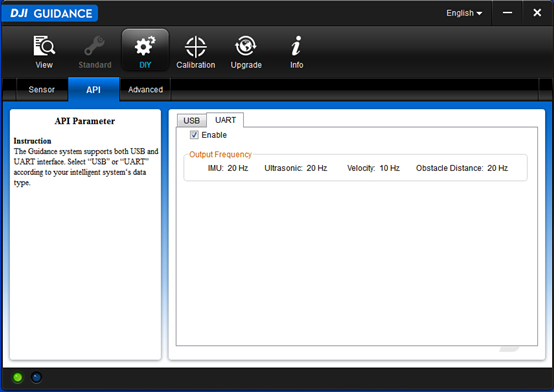

#
# 1 Background

This guide assumes that you have

- a Guidance system,

- a computer with OpenCV installed,

and you are:

- familiar with Linux programming,

- or familiar with Windows programming and Microsoft Visual Studio.

#
# 2 Introduction

This section introduces the structure of the Guidance SDK. The SDK is divided into three layers:


- **Application:** This layer processes data from the HAL layer. It is written by developers.

- **HAL:** This layer packs/parses the data to/from the Driver layer. It is implemented by the sample code (for UART) or SDK library (for USB), e.g. _libDJI\_guidance.so_.

- **Driver:** This layer receives data from the Guidance system through USB/UART. It is implemented by OS or 3rd party libraries, e.g. _libusb_.

## 2.1 Interface
The Guidance SDK supports two communication protocols: USB&UART.

### 2.1.1 USB

The supported data types are Velocity Data, Obstacle Distance Data, IMU Data, Ultrasonic Data, Greyscale Image, and Depth Image.

There are two ways to subscribe the data through USB.

1. Guidance Assistant Software

	User can use Guidance assistant software to subscribe the data in "DIY->API->USB" tab.

	- Connect Guidance with PC using USB cable, power on the Guidance
	- Choose the "Enable" check box
	- Choose the data according your requirement

	**Notes:** The available bandwidth is subject to the selection of image data and the output frequency. The selection of subscribed image data and output frequency will be saved and take effect when the Guidance system is turned off and on again.

	

2. Guidance API

	User can subscribe the data using Guidance API. Identity these API functions that are named with "select".

	**Notes:** If user subscribes the image data and output frequency using Guidance API functions, it will only temporarily override the data selection that is made in the Guidance Assistant software when the Guidance system is still powered on. However, the data selection that is made through the Guidance API will not permanently change the data subsections options stored in the Guidance system, unless you de-select the "Enable" option in the "USB" tab.

### 2.1.2 UART

The supported data types are Velocity Data, Obstacle Distance Data, IMU Data, and Ultrasonic Data.

1. Subscribe Data

	You may only use Guidance assistant software to subscribe UART data. Enable this selection from "DIY->API->UART" page. Same as USB, the configuration will be saved in Guidance Core, unless you de-select the "Enable" option in the "UART" tab.

	

2. Protocol Description

Protocol Frame Format:

| SOF | LEN | VER | RES | SEQ | CRC16 | DATA | CRC32 |
| --- | --- | --- | --- | --- | --- | --- | --- |

Protocol Frame Explanation:

| Field | Byte Index | Size（bit） | Description |
| --- | --- | --- | --- |
| SOF | 0 | 8 | Frame start number, fixed to be 0xAA |
| LEN | 1 | 10 | Frame length, maximum length is 1023 bytes |
| VER | 1 | 6 | Version of the protocol |
| RES | 5 | 40 | Reserved bits, fixed to be 0 |
| SEQ | 8 | 16 | Frame sequence number |
| CRC16 | 10 | 16 | Frame header CRC16 checksum |
| DATA | 12 | --① | Frame data, maximum length  1007bytes |
| CRC32 | --② | 32 | Frame CRC32checksum |

1. Frame data size can vary, 1007 is the maximum length.
2. The index of this field depends on the length of the data field.

Data Field Format:

| COMMAND SET | COMMAND ID | COMMAND DATA |
| --- | --- | --- |

Data Field Explanation:

| Data Field | Byte Index | Size（byte） | Description |
| --- | --- | --- | --- |
| COMMAND SET | 0 | 1 | Always 0x00 |
| COMMAND ID | 1 | 1 | e\_image: 0x00e\_imu: 0x01e\_ultrasonic: 0x02e\_velocity: 0x03e\_obstacle\_distance: 0x04 |
| COMMAND DATA | 2 | -- | Data body |

## 2.2 Data Types

Each of the supported data types is described below.

- **Velocity Data:** Outputs velocity information. The unit is **millimeter/second** and the frequency is 20 Hz.

- **Obstacle Distance Data:** Outputs obstacle distance for five directions. The unit is **centimeter** and the frequency is 20 Hz.

- **IMU Data:** Outputs IMU data, including accelerometer (in unit of meter/second) and attitude (in quaternion format) data. The frequency is 20 Hz.

- **Ultrasonic Data:** Outputs ultrasonic data for five directions, including obstacle distance (in unit of meter) and reliability of the data. The frequency is 20 Hz.

- **Greyscale Image:** Outputs Greyscale images for five directions. The image size is 320\*240 bytes for individual sensor. The default frequency is 20 Hz and can be scaled down using Guidance API.

- **Depth Image:** Outputs depth images for five directions. The image size is 320\*240\*2 bytes for each direction. The default frequency is 20 Hz and can be scaled down using Guidance API.
  
  **Notes:** In order to achieve best performance, it is suggested that large data (e.g. images) be copied instead of processing the data in-place, if the received data will be processed for a long time.

#
# 3 Getting Started

Guidance SDK have provided examples to get data from Guidance system. This section guides you how to execute these examples.

### 3.1 Run USB example in Linux

1. **Setup the environment.**

	The Guidance SDK use _libusb-1.0_ library to read data from Guidance system. Please reference _[http://www.libusb.org](http://www.libusb.org/)_ to compile and install the _libusb-1.0_ library.

2. **Copy related files.**

	Makefiles are provided and tested. The user does not need to change anything to run the example code.

	To use Guidance in their own projects, the user can follow the instructions below:

	- Copy _libDJI\_guidance.so_ to "library file path" of your project.

	- Copy _DJI\_guidance.h_ to "header file path".

	- Add the library in the Makefile of your project as shown below.	
	```
	LDFLAGS = -Wl,-rpath,./ -lpthread -lrt -L./ -L/usr/local/lib/ -l **DJI\_guidance** -lusb-1.0
	```


3. **Compile the example project.**

	

	**Note:** The default makefile assumes you don't have OpenCV installed and uses _Makefile\_noOpenCV_. You can specify the makefile during make according to your own case. For example if you have OpenCV installed, use the other makefile:

	~~~
	$ make –f Makefile
	~~~


4. **Connect Guidance via USB and run.**

	You need root permission to run this example:

	~~~
	$ sudo ./guidance_example
	~~~

	

### 3.2 Run USB example in Windows

1. **Setup the environment.**

	The Guidance SDK uses the _libusb_ library to read data from Guidance system. Please make sure the Guidance Assistant Software is installed properly which includes DJI USB driver.

2. **Configure Visual Studio.**

	Solutions for different versions of Visual Studio are provided and tested. The user do not need to change anything to run the example code.

	To use Guidance in their own projects, it is suggested to use the property sheets provided in the examples\usb\_example folder. The user only needs to change the directories of header and library files.

	~~~ xml
	<?xml version="1.0" encoding="utf-8"?>
	<Project ToolsVersion="4.0" xmlns="http://schemas.microsoft.com/developer/msbuild/2003">
	  <ImportGroup Label="PropertySheets" />
	  <PropertyGroup Label="UserMacros" />
	  <PropertyGroup />
	  <ItemDefinitionGroup>
	    <ClCompile>
	      <AdditionalIncludeDirectories>$(SolutionDir)..\..\include</AdditionalIncludeDirectories>
	      <AdditionalOptions>/DWIN32 %(AdditionalOptions)</AdditionalOptions>
	    </ClCompile>
	    <Link>      <AdditionalLibraryDirectories>$(SolutionDir)..\..\lib\2010\x86;</AdditionalLibraryDirectories>      <AdditionalDependencies>DJI_guidance.lib;%(AdditionalDependencies)</AdditionalDependencies>
	    </Link>
	  </ItemDefinitionGroup>
	  <ItemGroup />
	</Project>
	~~~

	Alternatively, the user can directly copy the files and configure Visual Studio as follows:

	- Copy _DJI\_guidance.dll_ and _DJI\_guidance.lib_ to "library file path" of your project.

	- Copy _DJI\_guidance.h_ to "header file path".

	- Add _DJI\_guidance.lib_ to your Visual Studio project's additional dependencies.

	

3. **Compile the example project.**

	Compile the example project using Microsoft Visual Studio.

4. **Connect the Guidance system for testing.**

	

### 3.3 Run UART example in Linux

1. **Subscribe UART data.**

	Please reference Section 2.1.2 to subscribe the UART data.

2. **Compile the example project.**

	

3. **Connect the Guidance system for testing.**

	

### 3.4 Run UART example in Windows

1. **Subscribe UART data.**

	Please reference Section 2.1.2 to subscribe the UART data.

2. **Compile the example project.**

	Compile the example project using Microsoft Visual Studio.

3. **Connect the Guidance system for testing.**

	

#
# 4 Data Structures

### e\_sdk\_err\_code

**Description:** Define error code of SDK.

~~~
enum e_sdk_err_code
{
    e_sdk_no_err = 0,
    e_load_libusb_err,
    e_sdk_not_inited,                  // SDK software is not ready 
    e_guidance_hardware_not_ready,     // Guidance hardware is not ready 
    e_disparity_not_allowed,           // if work type is standard, disparity is not allowed to be selected 
    e_image_frequency_not_allowed,     // image frequency must be one of the enum type e_image_data_frequecy 
    e_config_not_ready,                // get config including the work type flag, before you can select data 
    e_online_flag_not_ready,           // online flag is not ready 
    e_max_sdk_err = 100
};
~~~


### e\_vbus\_index

**Description:** Define logical direction of vbus, i.e. the pair camera selected.


~~~
enum e_vbus_index
{
    e_vbus1 = 1,        // logic direction of vbus
    e_vbus2 = 2,        // logic direction of vbus
    e_vbus3 = 3,        // logic direction of vbus
    e_vbus4 = 4,        // logic direction of vbus
    e_vbus5 = 0         // logic direction of vbus
};
~~~

### e\_image\_data\_frequecy

**Description:** Define frequency of image data.

~~~
enum e_image_data_frequecy
{
    e_frequecy_5  = 0,  // frequecy of image data 
    e_frequecy_10 = 1,  // frequecy of image data 
    e_frequecy_20 = 2   // frequecy of image data 
};

~~~

### user\_callback

**Description:** Call back function prototype.

**Parameters:** event\_type use it to identify the data type: image, imu, ultrasonic, velocity or obstacle distance; data\_len length of the input data; data input data read from GUIDANCE

**Return:** non-zero if error occurs


~~~

typedef int (*user_call_back)( int event_type, int data_len, char *data );

~~~


### e\_guidance\_event

**Description:** Define event type of callback.


~~~

enum e_guidance_event
{
    e_image = 0,            // called back when image comes 
    e_imu,                  // called back when imu comes 
    e_ultrasonic,           // called back when ultrasonic comes 
    e_velocity,             // called back when velocity data comes 
    e_obstacle_distance,    // called back when obstacle data comes 
    e_event_num
};

~~~

### image\_data

**Description:** Define image data structure. The center of depth image coincides with the corresponding left greyscale image's.

~~~
typedef struct _image_data
{
    unsigned int     frame_index;   // frame index 
    unsigned int     time_stamp;    // time stamp of image captured in ms 
    char      *m_greyscale_image_left[CAMERA_PAIR_NUM];   // greyscale image of left camera 
    char      *m_greyscale_image_right[CAMERA_PAIR_NUM];  // greyscale image of right camera 
    char      *m_depth_image[CAMERA_PAIR_NUM];   // depth image 
}image_data;
~~~

### ultrasonic\_data

**Description:** Define ultrasonic data structure. Unit is `mm`.

~~~
typedef struct _ultrasonic_data
{
    unsigned int     frame_index;    // corresponse frame index 
    unsigned int     time_stamp;     // time stamp of corresponse image captured in ms 
    unsigned short   ultrasonic[CAMERA_PAIR_NUM];    // distance 
    unsigned short   reliability[CAMERA_PAIR_NUM];   // reliability of the distance data 
}ultrasonic_data;
~~~

### velocity

**Description:** Define velocity structure. Unit is `mm`.


~~~
typedef struct _velocity
{
    unsigned int     frame_index;        // corresponse frame index 
    unsigned int     time_stamp;         // time stamp of corresponse image captured in ms 
    short            vx;                      // velocity of x 
    short            vy;                      // velocity of y 
    short            vz;                      // velocity of z 
}velocity;
~~~


### obstacle\_distance

**Description:** Define obstacle distance structure. Unit is `cm`.

~~~
typedef struct _obstacle_distance
{
    unsigned int     frame_index;       // corresponse frame index 
    unsigned int     time_stamp;        // time stamp of corresponse image captured in ms 
    unsigned short   distance[CAMERA_PAIR_NUM];     // distance of obstacle 
}obstacle_distance;
~~~

### imu

**Description:** Define imu structure. Unit of acceleration is `m^2/s`. 

~~~

typedef struct _imu
{
    unsigned int     frame_index;             // corresponse frame index 
    unsigned int     time_stamp;              // time stamp of corresponse image captured in ms 
    float            acc_x;                   // acceleration of x 
    float            acc_y;                   // acceleration of y 
    float            acc_z;                   // acceleration of z 
    float            q[4];                    // attitude data 
}imu;
~~~

#
# 5 API

### Overview

The GUIDANCE API provides configuration and control methods for GUIDANCE with C interface.


Here is an overview of the key methods available in this API:

~~~
// Guidance initialization
SDK_API int reset_config( void );
SDK_API int init_transfer( void );

// Guidance subscribe data
SDK_API void select_imu( void );    
SDK_API void select_ultrasonic( void );
SDK_API void select_velocity( void );   
SDK_API void select_obstacle_distance( void ); 
SDK_API int set_image_frequecy( e_image_data_frequecy frequecy ); 
SDK_API int select_depth_image( e_vbus_index camera_pair_index ); 
SDK_API int select_greyscale_image( e_vbus_index camera_pair_index, bool is_left ); 

// Guidance set event
SDK_API int set_sdk_event_handler( user_call_back handler );

// Guidance transfer control
SDK_API int start_transfer( void );
SDK_API int stop_transfer( void );
SDK_API int release_transfer( void );

// Guidance get status 
SDK_API int get_online_status( int online_status[CAMERA_PAIR_NUM] );
~~~


### Method

#### reset\_config

**Description:** Clear the subscribed configure, if you want to subscribe the different data from last time.

**Parameters:** NULL

**Return:** error code. Non-zero if error occurs

~~~
SDK_API int reset_config ( void );
~~~


#### init\_transfer

**Description:** Initialize the GUIDANCE and connect it to PC.

**Parameters:** NULL

**Return:** error code. Non-zero if error occurs

~~~
SDK_API int init_transfer ( void );
~~~

#### select\_imu

**Description:** Subscribe to imu.

**Parameters:** NULL

**Return:** NULL

~~~
SDK_API void select_imu ( void );
~~~

#### select\_ultrasonic

**Description:** Subscribe to ultrasonic.

**Parameters:** NULL

**Return:** NULL

~~~
SDK_API void select_ultrasonic ( void );
~~~

#### select\_velocity

**Description:** Subscribe to velocity data, i.e. velocity of GUIDANCE in body coordinate system.

**Parameters:** NULL

**Return:** NULL

~~~
SDK_API void select_velocity ( void );
~~~


#### select\_obstacle\_distance

**Description:** Subscribe to obstacle distance, i.e. distance from obstacle.

**Parameters:** NULL

**Return:** NULL


~~~
SDK_API void select_obstacle_distance ( void );
~~~


#### set\_image\_frequecy

**Description:** Set frequency of image transfer.

(p.s. As the bandwidth of USB is limited, if you subscribe too much images (greyscale image or depth image), the frequency should be relatively small, otherwise the SDK cannot guarantee the continuity of image transfer.)

**Parameters:** frequencyis the frequency of image transfer

**Return:** error code. Non-zero if error occurs

~~~
SDK_API int set_image_frequecy ( e_image_data_frequecy frequecy );
~~~

#### select\_depth\_image

**Description:** Subscribe to depth image data.

**Parameters:** camera\_pair\_index index of camera pair selected

**Return:** NULL


~~~
SDK_API void select_depth_image ( e_vbus_index camera_pair_index );
~~~

#### select\_greyscale\_image

**Description:** Subscribe to rectified grey image data.

**Parameters:** camera\_pair\_index index of camera pair selected; is\_left whether the image data selected is left

**Return:** error code. Non-zero if error occurs

~~~
SDK_API int select_greyscale_image ( e_vbus_index camera_pair_index, bool is_left );
~~~

#### set\_sdk\_event\_handler

**Description:** Set callback, when data from GUIDANCE comes, it will be called by transfer thread.

**Parameters:** handler pointer to callback function.

**Return:** error code. Non-zero if error occurs

~~~
SDK_API int set_sdk_event_handler ( user_call_back handler );
~~~

#### start\_transfer

**Description:** Send message to GUIDANCE to start data transfer.

**Parameters:** NULL .

**Return:** error code. Non-zero if error occurs

~~~
SDK_API int start_transfer ( void );
~~~

#### stop\_transfer

**Description:** Send message to GUIDANCE to stop data transfer.

**Parameters:** NULL .

**Return:** error code. Non-zero if error occurs

~~~
SDK_API int stop_transfer ( void );
~~~

#### release\_transfer

**Description:** Release the data transfer thread.

**Parameters:** NULL .

**Return:** error code. Non-zero if error occurs

~~~
SDK_API int release_transfer ( void );
~~~

#### get\_online\_status

**Description:** Get the online status of GUIDANCE sensors.

**Parameters:** online\_status[CAMERA\_PAIR\_NUM] online status of GUIDANCE sensors

**Return:** error code. Non-zero if error occurs

~~~
SDK_API int get_online_status (int online_status[CAMERA_PAIR_NUM] );
~~~

**Notes** : These are only used for USB transfer type. Please reference the protocol of Section 2.1.2 when using UART transfer type.
