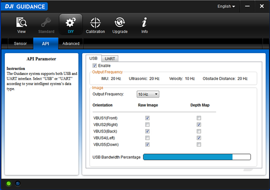

# Guidance SDK Reference

*如有任何错误或错误，请给我们使用Github的问题或DJI论坛或电子邮件报告。欢迎您把您拉入请求帮助我们解决问题。然而，涉及到文档的所有引入请求必须遵循[文档样式](https://github.com/dji-sdk/Guidance-SDK/issues/3)*。

## 背景

此文档提供了关于SDK的结构和API函数的详细解释。我们假设你有

- 一个Guidance系统，
- 一台安装了OpenCV的计算机

并且你：

- 熟悉Linux编程，
- 或者熟悉Windows编程和Microsoft Visual Studio使用。

## 简介

本节介绍指导SDK的结构。该SDK分为三个层次：

- **应用：**该层处理由HAL层传来的数据，由开发者编写。
- **HAL：**硬件抽象层。该层打包/解析从驱动层传来的数据，由示例代码实现（串口）SDK库（用于USB）实现，例如*libDJI_guidance.so*。
- **驱动：**该层通过USB或者串口从Guidance接收数据，由操作系统或第三方库（如_libusb_）实现。

### 接口

Guidance SDK支持两种通信协议：USB和串口。

#### 1. USB

支持的数据类型包括速度数据，障碍物距离数据，IMU数据，超声波数据，灰度图像和深度图像。

有两种方法可以通过USB订阅数据。

1. Guidance Assist软件
	用户可以使用Guidance Assist软件中的“DIY-> API - > USB”选项卡来订阅数据。

	- 使用USB线连接Guidance和PC，将Guidance上电
	- 选择“启用”复选框
	- 根据您的需求选择数据

	**注：**可用带宽是受制于选择的图像数据和输出频率。订阅图像数据和输出频率的选择将被保存在Guidance系统上，并在Guidance下一次启动时生效。

	
2. Guidance API
	用户可以通过Guidance API订阅数据，这些API函数的名字都以"select"开头。

	**注：**如果用户通过Guidance API函数来订阅图像数据和输出频率，它只会在Guidance上电期间临时生效，Guidance断电后将恢复到Guidance Assist设置的状态。

#### 2. 串口

串口的输出数据类型包括速度数据，障碍物距离数据，IMU数据和超声波数据。由于带宽限制，图像数据不通过UART输出。

**注：**Guidance串口目前只支持**115200**波特率。

1. 订阅数据

	您只能使用Guidance Assist软件订阅UART数据。从“DIY-> API - > UART”页面启用串口。与USB相同，该配置将被保存在Guidance系统上，除非你在“UART”选项卡中取消选择“启用”选项。
	

2. 协议说明

	协议帧格式：

| SOF | LEN | VER | RES | SEQ | CRC16 | DATA | CRC32 |
| --- | --- | --- | --- | --- | --- | --- | --- |

协议帧解释：

| Field | Byte Index | Size（bit） | Description |
| --- | --- | --- | --- |
| SOF | 0 | 8 | Frame start number, fixed to be 0xAA |
| LEN | 1 | 10 | Frame length, maximum length is 1023 bytes |
| VER | 1 | 6 | Version of the protocol |
| RES | 5 | 40 | Reserved bits, fixed to be 0 |
| SEQ | 8 | 16 | Frame sequence number |
| CRC16 | 10 | 16 | Frame header CRC16 checksum |
| DATA | 12 | --① | Frame data, maximum length  1007 bytes |
| CRC32 | --② | 32 | Frame CRC32 checksum |

① 帧数据大小是可变的，最大为1007字节。

② 该域的索引取决于数据域的长度。

数据域格式：

| COMMAND SET | COMMAND ID | COMMAND DATA |
| --- | --- | --- |

数据域解释：

| Data Field | Byte Index | Size（byte） | Description |
| --- | --- | --- | --- |
| COMMAND SET | 0 | 1 | Always 0x00 |
| COMMAND ID | 1 | 1 | e\_image: 0x00; e\_imu: 0x01; e\_ultrasonic: 0x02; e\_velocity: 0x03; e\_obstacle\_distance: 0x04 |
| COMMAND DATA | 2 | -- | Data body |

### 数据类型

支持的数据类型描述如下。

- [**错误码：**](#e_sdk_err_code) 列举可能的错误代码。当错误发生时，通常会返回一个错误码，而开发者可以参考此枚举来检查错误类型。
- [**速度数据：**](#velocity) 机体坐标下的速度。单位是**毫米每秒**，频率是10 Hz.
- [**障碍物距离数据:**](#obstacle_distance) 从五个Guidance传感器模块读取的障碍物距离数据。单位是**厘米**，频率是20 Hz.
- [**IMU数据：**](#imu) IMU数据，包括加速度计（单位为重力加速度**g**）和陀螺仪（四元数格式）数据。频率为20 Hz.
- [**超声波数据：**](#ultrasonic_data) 输出从五个Guidance传感器读取的超声波数据，包括障碍物距离（单位为**米**）和数据的可靠性。频率为20 Hz.
- [**灰度图像：**](#image_data) 输出五个方向的8比特灰度图像。每张图像分辨率为320\*240. 默认频率为20Hz，可以通过API​​函数降频。
- [**深度图像：**](#image_data) 输出五个方向的16比特深度图像。每张图像分辨率为320\*240. 默认频率为20Hz，可以通过API​​函数降频。
- [**视差图像：**](#image_data) 输出五个方向的16比特视差图像。这个数据在开发者想要进一步优化视差图时是有用的，比如用speckle filter等函数优化。每张图像分辨率为320\*240. 默认频率为20Hz，可以通过API​​函数降频。

## 数据结构

### e\_sdk\_err\_code

**描述：**定义SDK的错误代码。

~~~ cpp
enum e_sdk_err_code
{
	e_timeout = -7,						// USB传输超时
	e_libusb_io_err = -1,				// libusb库IO错误
    e_sdk_no_err = 0,					// 成功，没有错误
    e_load_libusb_err=1,				// 加载的libusb库错误
    e_sdk_not_inited=2,					// SDK软件还没有准备好
    e_hardware_not_ready=3,				// Guidance硬件还没有准备好
    e_disparity_not_allowed=4,			// 视差图或深度图不允许被选择
    e_image_frequency_not_allowed=5,	// 图像频率必须是枚举类型e_image_data_frequecy之一
    e_config_not_ready=6,				// 配置没有准备好
    e_online_flag_not_ready=7,			// 在线标志没有准备好 
	e_stereo_cali_not_ready = 8,		// 摄像头标定参数没有准备好
    e_max_sdk_err = 100					// 错误最大数量
};
~~~

**解释：** 

1. `e_timeout`: USB传输超时。
2. `e_libusb_io_err`: libusb库IO错误。这可能由USB的连接错误引起。
3. `e_OK`: 成功，没有错误。
4. `e_load_libusb_err`: 加载的libusb库错误。这是由于使用了不正确的libusb库。
5. `e_sdk_not_inited`: SDK软件还没有准备好。
6. `e_hardware_not_ready`: Guidance硬件还没有准备好。
7. `e_disparity_not_allowed`: 如果您的Guidance工作在标准模式下，且激活了障碍物感知功能，那么视差图和深度图是不允许被选择的。因为障碍物感知有自己的选择视差图的方法。
8. `e_image_frequency_not_allowed`: 图像频率必须是枚举类型`e_image_data_frequecy`之一。目前只支持3种传输频率：5Hz, 10Hz, 20Hz.
9. `e_config_not_ready`: 配置数据没有准备好。Guidance上电时，需要花几秒钟时间（有时更长）来进行初始化，包括加载配置数据到内存，并将数据发送至应用层（即SDK软件）。如果用户在配置数据准备好之前启动了SDK程序，这个错误就会被抛出。配置数据包括：Guidance的工作模式，Guidance传感模块的在线状态，标定参数，等待。
10. `e_online_flag_not_ready`: 在线标志没有准备好。Guidance系统允许用户使用任意数目的传感模块，从1到5. 我们使用一个在线状态数组来标识哪些传感模块是在线的。如果用户从不在线的传感模块订阅了数据，那么不会有数据传输过来。
11. `e_stereo_cali_not_ready`: 摄像头标定参数没有准备好。这个参数对三维应用是有用的。因为图像已经是校正过的图像，我们没有提供畸变系数，只提供了：主点坐标`cu, cv`，焦距`focal`，和基线长度`baseline`.  

### e\_vbus\_index

**描述：**定义VBUS的逻辑方向，即Guidance传感模块的方向。注意它们只取决于Guidance处理模块上的VBUS接口，而不是Guidance传感模块。

每个枚举值的注释说明了当Guidance以默认方式安装在Matrice 100上时该枚举值代表的方向。但开发者可以任意方式安装Guidance在任意的设备上，因此

~~~ cpp
enum e_vbus_index
{
    e_vbus1 = 1,        // M100上为前视
    e_vbus2 = 2,        // M100上为右视
    e_vbus3 = 3,        // M100上为后视
    e_vbus4 = 4,        // M100上为左视
    e_vbus5 = 0         // M100上为下视
};
~~~

### e_image_data_frequecy

**描述：**定义图像数据的频率。可选的频率有：5Hz, 10Hz, 20Hz. 订阅的图像越多，传输的频率就越低。

~~~ cpp
enum e_image_data_frequecy
{
    e_frequecy_5  = 0,  // frequecy of image data: 5Hz  
    e_frequecy_10 = 1,  // frequecy of image data: 10Hz  
    e_frequecy_20 = 2   // frequecy of image data: 20Hz  
};
~~~

### e_guidance_event

**描述：**定义回调的事件类型。

~~~ cpp
enum e_guidance_event
{
    e_image = 0,            // called back when image comes 
    e_imu,                  // called back when imu comes 
    e_ultrasonic,           // called back when ultrasonic comes 
    e_velocity,             // called back when velocity data comes 
    e_obstacle_distance,    // called back when obstacle data comes 
    e_event_num
};
~~~

### image_data

**描述：**定义图像的数据结构。每个方向的深度图与双目灰度图中的左图对齐。

~~~ cpp
typedef struct _image_data
{
	unsigned int     frame_index;	                              // frame index 
	unsigned int     time_stamp;	                              // time stamp of image captured in ms 
	char             *m_greyscale_image_left[CAMERA_PAIR_NUM];	  // greyscale image of left camera 
	char             *m_greyscale_image_right[CAMERA_PAIR_NUM];   // greyscale image of right camera 
	char             *m_depth_image[CAMERA_PAIR_NUM];	          // depth image in meters 
	char             *m_disparity_image[CAMERA_PAIR_NUM];         // disparity image in pixels 
}image_data;
~~~ 

### ultrasonic_data

**描述：**定义超声波的数据结构。`ultrasonic`是超声波传感器检测到的最近物体的距离，单位是`mm`。`reliability`是该距离测量的可信度，1为可信，0为不可信。由于观测数据存在噪声，建议对数据进行滤波后再使用。

~~~ cpp
typedef struct _ultrasonic_data
{
    unsigned int     frame_index;    // corresponse frame index 
    unsigned int     time_stamp;     // time stamp of corresponse image captured in ms 
    short            ultrasonic[CAMERA_PAIR_NUM];	// distance in mm. -1 means invalid measurement. 
    unsigned short   reliability[CAMERA_PAIR_NUM];   // reliability of the distance data 
}ultrasonic_data;
~~~

### velocity

**描述：**定义体坐标系下的速度。单位是`mm/s`。

~~~ cpp
typedef struct _velocity
{
    unsigned int     frame_index;        // corresponse frame index 
    unsigned int     time_stamp;         // time stamp of corresponse image captured in ms 
    short            vx;                 // velocity of x in mm/s
    short            vy;                 // velocity of y in mm/s 
    short            vz;                 // velocity of z in mm/s 
}velocity;
~~~

### obstacle_distance

**描述：**定义由视觉和超声波融合得到的障碍物距离。单位是`cm`。

~~~ cpp
typedef struct _obstacle_distance
{
    unsigned int     frame_index;    // corresponse frame index 
    unsigned int     time_stamp;     // time stamp of corresponse image captured in ms 
    unsigned short   distance[CAMERA_PAIR_NUM];  // distance of obstacle in cm
}obstacle_distance;
~~~

### imu

**描述：**定义IMU数据结构。加速度单位为`m/s^2`。

~~~ cpp
typedef struct _imu
{
    unsigned int     frame_index;             // corresponse frame index 
    unsigned int     time_stamp;              // time stamp of corresponse image captured in ms 
    float            acc_x;                   // acceleration of x in unit of m/s^2
    float            acc_y;                   // acceleration of y in unit of m/s^2
    float            acc_z;                   // acceleration of z in unit of m/s^2
    float            q[4];                    // quaternion: [w,x,y,z]
}imu;
~~~

###   stereo_cali

**描述:**  摄像头的标定参数。如果某个方向的传感器不在线，则所有值为0.

~~~ cpp
typedef struct _stereo_cali
{
	float cu;			// x position of focal center in units of pixels 
	float cv;			// y position of focal center in units of pixels 
	float focal;		// focal length in units of pixels 
	float baseline;		// baseline of stereo cameras in units of meters 
	_stereo_cali() { }
	_stereo_cali(float _cu, float _cv, float _focal, float _baseline)
	{
		cu = _cu, cv = _cv;
		focal = _focal, baseline = _baseline;
	}
}stereo_cali;
~~~ 

###   exposure_param

**描述:**  摄像头的曝光参数。当m_expo_time = m_expected_brightness=0时，变成默认的自动曝光控制。 

~~~ cpp
typedef struct _exposure_param
{
	float	      m_step;		// adjustment step for auto exposure control (AEC). Default is 10.
	float		  m_exposure_time;	// constant exposure time in mini-seconds. Range is 0.1~20. Default is 7.25.
	unsigned int  m_expected_brightness;// constant expected brightness for AEC. Range is 50~200. Default is 85.
	unsigned int  m_is_auto_exposure;	// 1: auto exposure; 0: constant exposure
	int           m_camera_pair_index;	// index of Guidance Sensor
	_exposure_param(){
		m_step = 10;
		m_exposure_time = 7.68;
		m_expected_brightness = 85;
		m_is_auto_exposure = 1;
		m_camera_pair_index = 1;
	}
}exposure_param;
~~~ 

## API

### 概述

对USB接口，Guidance API提供了配置和控制Guidance的C接口。下面是该API提供的关键方法的概览。

当使用UART传输时请参考第2.​​1.2节的协议，以及`uart_example`示例代码。

- 初始化
	- [reset_config](#reset_config)
	- [init_transfer](#init_transfer)

- 订阅数据
	- [select_imu](#select_imu)
	- [select_ultrasonic](#select_ultrasonic)
	- [select_velocity](#select_velocity)
	- [select_obstacle_distance ](#select_obstacle_distance )
	- [set_image_frequecy](#set_image_frequecy)
	- [select_depth_image](#select_depth_image)
	- [select_greyscale_image](#select_greyscale_image)

- 设置回调函数和曝光
	- [set_sdk_event_handler](#set_sdk_event_handler)
	- [set_exposure_param](#set_exposure_param)

- 获取数据
	- [get_online_status](#get_online_status)
	- [get_stereo_cali](#get_stereo_cali)

- 传输控制
	- [start_transfer](#start_transfer)
	- [stop_transfer](#stop_transfer)
	- [release_transfer](#release_transfer)
	- [wait_for_board_ready](#wait_for_board_ready)

### 方法

#### user_callback

- **描述：**回调函数的原型。 开发者的回调函数必须按照该原型编写。为了达到最佳性能，建议在回调函数中不执行任何耗时的处理，只复制数据。否则，传输频率可能会有所降低。
- **参数：**`event_type`使用它来识别数据类型：图像，IMU，超声波，速度或障碍物距离;`data_len`输入数据的长度; `data`从Guidance输入的数据。
- **返回：**`错误码`。如果发生错误为非零。

~~~ cpp
typedef int (*user_call_back)( int event_type, int data_len, char *data );
~~~

#### reset_config

- **描述：**清除订阅的配置，如果你想订阅跟上次不同的数据。
- **参数：**空
- **返回：**`错误码`。如果发生错误则非零。

~~~ cpp
SDK_API int reset_config ( void );
~~~

#### init_transfer

- **描述：**初始化Guidance，创建数据传输线程。
- **参数：**空
- **返回：**`错误码`。如果发生错误则非零。

~~~ cpp
SDK_API int init_transfer ( void );
~~~

#### select_imu

- **描述：**订阅IMU数据。在标准模式下，必须连接DJI N1飞控才能输出IMU数据。在自定义模式下则不需要连接飞控就可以输出。
- **参数：**空
- **返回：**空

~~~ cpp
SDK_API void select_imu ( void );
~~~

#### select_ultrasonic

- **描述：**订阅超声波数据。
- **参数：**空
- **返回：**空

~~~ cpp
SDK_API void select_ultrasonic ( void );
~~~

#### select_velocity

- **描述：**订阅速度数据。
- **参数：**空
- **返回：**空

~~~ cpp
SDK_API void select_velocity ( void );
~~~

#### select_obstacle_distance

- **描述：**订阅障碍物距离数据。
- **参数：**空
- **返回：**空

~~~ cpp
SDK_API void select_obstacle_distance ( void );
~~~

#### set_image_frequecy

- **描述：**设定图像传输的频率。
**注意：**由于USB的带宽限制，如果订阅太多的图像（灰度图像或深度图像），应设置较小的频率，否则在SDK不能保证图像传输的连续性。
- **参数：**`frequency` 图像传输的频率。
- **返回：**`错误码`。如果发生错误则非零。

~~~ cpp
SDK_API int set_image_frequecy ( e_image_data_frequecy frequecy );
~~~

#### select_depth_image

- **描述：**订阅深度图像数据。
- **参数：**`camera_pair_index` 选定双目相机对的索引。
- **返回：**空

~~~ cpp
SDK_API void select_depth_image ( e_vbus_index camera_pair_index );
~~~

#### select_greyscale_image

- **描述：**订阅纠正灰度图像数据。
- **参数：**`camera_pair_index` 选择的摄像机对索引; `is_left`是否选择左边的图像：为`true`时选择左图，为`false`时选择右图。
- **返回：**`错误码`。如果发生错误则非零。

~~~ cpp
SDK_API int select_greyscale_image ( e_vbus_index camera_pair_index, bool is_left );
~~~

#### set_sdk_event_handler

- **描述：**设置回调函数指针。当有数据从Guidance传过来时，回调函数将被传输线程调用。
- **参数：**`handler` 回调函数指针。
- **返回：**`错误码`。如果发生错误则非零。

~~~ cpp
SDK_API int set_sdk_event_handler ( user_call_back handler );
~~~

#### start_transfer

- **描述：**通知Guidance开始传输数据。
- **参数：**空。
- **返回：**`错误码`。如果发生错误则非零。

~~~ cpp
SDK_API int start_transfer ( void );
~~~

#### stop_transfer

- **描述：**通知Guidance停止数据传输。
- **参数：**空。
- **返回：**`错误码`。如果发生错误则非零。

~~~ cpp
SDK_API int stop_transfer ( void );
~~~

#### release_transfer

- **描述：**释放数据传输线程。
- **参数：**空。
- **返回：**`错误码`。如果发生错误则非零。

~~~ cpp
SDK_API int release_transfer ( void );
~~~

#### get_online_status

- **描述：**获取Guidance传感模块的在线状态。
- **参数：**`online_status[CAMERA_PAIR_NUM]` Guidance传感模块的在线状态的数组。
- **返回：**`错误码`。如果发生错误则非零。

~~~ cpp
SDK_API int get_online_status (int online_status[CAMERA_PAIR_NUM] );
~~~

####  wait_for_board_ready

- **描述：** 等待Guidance处理模块的准备信号。该函数最多会等待20秒，如果20秒内没有收到准备好信号，则返回一个超时错误。开发者一般不需要使用这个函数，因为它已经在init_transfer中被调用。
- **参数：**空。
- **返回：**  `错误码`。如果发生错误则非零。

~~~ cpp
SDK_API int wait_for_board_ready();
~~~ 

####  set_exposure_param

- **描述：** 设置曝光模式及参数。
- **参数：** `param` 曝光参数结构体的指针。
- **返回：**  `错误码`。如果发生错误则非零。

~~~ cpp
SDK_API int set_exposure_param( exposure_param *param );
~~~ 
