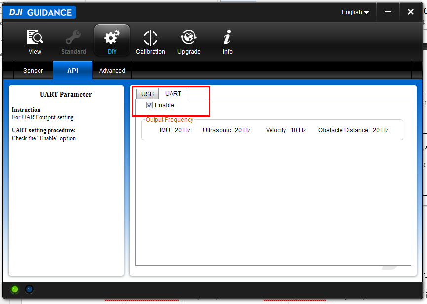

# Guidance SDK Developer Guide

*In case of any mistake or bug, please report to us using Github issue or DJI forum or email. You are welcome to send your pull request helping us fix issue. However, all pull requests related to document must follow the [document style](https://github.com/dji-sdk/Guidance-SDK/issues/3)*

## SDK Package Download

Guidance SDK is maintained and updated on GitHub.

- [Guidance-SDK](https://github.com/dji-sdk/Guidance-SDK): the complete package, including header file, library files on all platforms, and all documents.
- [Guidance-SDK-ROS](https://github.com/dji-sdk/Guidance-SDK-ROS): the ROS package, including header file, library files on Ubuntu and Odroid XU3.

## Environment Setup

### Windows

#### Install “Guidance Assistant” Software

Install “Guidance Assistant” software firstly, which provides the USB driver under Windows platform. Restart your PC after installation, there will be **“DJI, Inc. - Guidance”** in Device Manager when Guidance is powered and connected to PC, which indicates the installation is successful.

   

#### Install UART Driver

Install **USB\_TO\_RS232** driver if you want to use SDK via UART. Notice that Guidance SDK reads port **“COM5”** by default.

#### Activate and Subscribe Data

>*Assume that “Guidance Assistant” software has been correctly installed on Windows.* 

-	Connect Guidance to PC and power it on. Open the “Guidance Assistant” software, wait until the light on the left-bottom green up and switch to **“DIY”** mode on the **view** page.

  

-	Then change to **DIY** page, activate **USB** or **UART**, and subscribe the data you want.

>*Notice: You can also subscribe data by API functions provided by the SDK package.*

  

  

-	Close the software and restart Guidance to enable configure works. 

>*Notice: If you do not close the software Guidance Assistant, you will not be able to use Guidance SDK as the connection to Guidance Core is occupied.* 

#### Visual Studio Is Recommended

We provide a bunch of property sheet files \*.prop including **“use\_Guidance\_\*.prop”** and **“use\_opencv\_\*.prop”** under Visual Studio 2010/2013, which are well tested on Win7 x86/x64, you could simply add them to your project. Of course, just choose whatever compiler you like.

#### Install OpenCV

Opencv2.4.8/9/11 are well tested with Guidance SDK, you can download the version you like from http://opencv.org/. 
>*Notice that we define $(OPENCVROOT) as a variable of OpenCV path in the provided example and Demo projects, therefore it is suggested to add a variable named OPRNCVROOT in computer environment variable for the ease of use.*

For example: 
>*Suppose the installed directory of Opencv2.4.11 in your computer is D:/OPENCV/opencv2411/build[sources].* 

-	Add **$(OPENCVROOT)** to your environment variables, i.e., create an environment variable, whose name is **OPENCVROOT** and value is **D:/OPENCV/opencv2411/**.

  

- Then add the OpenCV bin path to your environment path. You should tails the follows to variable Path: 
**D:/OPENCV/opencv2411/build/x64/vc10/bin;** 
**D:/OPENCV/opencv2411/build/x86/vc10/bin;**    
-	If you use visual studio as development environment, just add **“use\_Guidance\_\*.prop”** and **“use\_opencv\_\*.prop”** provided by SDK example to your project. Otherwise, remember to add the path of .dll, .lib, .h of Guidance SDK and OPENCV to your project. 

#### Place DJI\_guidance.dll Properly

Remember to copy corresponding DJI\_guidance.dll to **/PATH/TO/YOUR/EXE**. Of course .dll, .h and .lib should be placed at correct places too.

  

### Linux

#### Install USB Driver

Download and unzip “libusb-1.0.9.tar.bz2” file from http://www.libusb.org/ , and install it correctly by instruction. Install from `apt-get` is not recommended.

For example, unzip libusb-1.0.9.tar.bz2 first and` cd `to **PATH/TO/LIBUSB\_DIR**, then

	>> ./configure
	>> make
	>> make install

#### Install UART Driver

Linux includes **USB** to **UART** driver by default. 

#### Activate and Subscribe Data 

Refers to **Install “Guidance Assistant” software** in Windows
 
#### Update g++ Compiler To Latest 

Make sure the g++ compiler on your computer is the latest version, check the time on your computer synchrony to real-world! 

For example:

	>> sudo apt-get install g++

#### Install OpenCV

- You can use apt-get to install opencv: 

		>> sudo apt-get install libopencv-dev

- Or make from source. 
- Or, you can download the **Install-OpenCV-master** from GitHub, which is provided by jayrambhia. There are shell scripts in it to install different version of OpenCV in different distributions of Linux. One can install OpenCV by use these scripts easily. 

For example:

	>> cd PATH/TO/Install-OpenCV-master/Ubuntu 
	>> ./dependencies.sh 
	>> cd 2.4
	>> ./opencv2_4_9.sh

#### Place DJI\_guidance.so Properly

Copy corresponding **libDJI\_guidance.so** to **/usr/local/lib**.

For example: 

	>> sudo cp libDJI_guidance.so /usr/local/lib

#### Run by sudo

- When using the USB port of Guidance SDK, `sudo` command is required to get root privilege of USB port, otherwise an error of *permission denied* will occur. For example:

		>> sudo ./guidance_example

- To save the trouble of using `sudo` every time you run Guidance SDK programs, you can also create a file `51-guidance.rules` in `/etc/udev/rules.d/` with the following content:

		SUBSYSTEM=="usb", ATTR{idVendor}=="fff0", ATTR{idProduct}=="d009", MODE="0666"

	Then disconnect and connect again USB cable of Guidance Core. Now you will be able to run Guidance SDK programs without `sudo`.

## Common Errors

>**Set up your environment according to the steps in Developer Guide can avoid most of the errors.**

### Connection error

***Description:*** 
**“usb error”** or things like that happen, for example:

  

***Solution:***

-	Make sure Guidance has been connected to PC and green light on Guidance Sensor starts to flicker.
- 	Check whether USB driver is installed correctly, look up **“Device Manager”** on Windows platform. Otherwise install it by construction in Developer Guide.
-	Check if UART port is **“COM5”** or you set before.
-	Check if you activated and subscribed the data via “Guidance Assistant” software, and Guidance is set to **“custom mode”**, otherwise refers to Developer Guide.
-	Restart the Guidance, if quit improperly last time, i.e. the data transfer thread quit before **stop\_transfer()** and **release\_transfer()**.
-	Remember to run program by `sudo` in Linux.
-	Do not run your program until the green light on Guidance Sensor starts to flicker. 
-	Make sure “Guidance Assistant” software is closed when you are using SDK.
-	Errors happened at times when running on a virtual machine.  

### Build error

#### Error while loading shared libraries

***Description:***

> Error while loading shared libraries : libDJI_guidance.so: cannot open shared object file : No such file or directory.

***Solution:***

-	Make sure that the corresponding **DJI\_guidance.so** is placed in the library path (eg **/usr/local/lib**), or copy **DJI\_guidance.so** to **/PATH/TO/RUNPATH** if it doesn’t work.
-	Make sure **DJI\_guidance.so** is compatible to your system.

#### Cannot open DJI\_guidance.dll file

***Description:***

> Cannot open DJI_guidance.dll file:No such file or directory.

***Solution:*** 
Make sure that corresponding **DJI\_guidance.dll** is placed in the RUNPATH.

#### OpenCV related error

***Description:***

> Cannot open OpenCV related *.h or *.dll.

***Solution:***

Check the configuration of OpenCV, remember that we use **$(OPENCVROOT)** as an environment variable in examples.

### Data transfer error

***Description:***

Data transfer error occurs means you may get a wrong image, for example:

   

***Solution:*** 

-	Check your code first and test Guidance on provided examples.
-	Restart Guidance, run your program after green light on Guidance start to flicker, and be sure end your program properly with **stop\_transfer()** and **release\_transfer()**.

