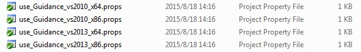

# Run examples

*In case of any mistake or bug, please report to us using Github issue or DJI forum or email. You are welcome to send your pull request helping us fix issue. However, all pull requests related to document must follow the [document style](https://github.com/dji-sdk/Guidance-SDK/issues/3)*.

---

Guidance SDK have provided examples to get data from Guidance system. This section guides you how to execute these examples.

## Run USB example in Linux

**1. Setup the environment.**

The Guidance SDK use _libusb-1.0.9_ library to read data from Guidance system. Please reference _[http://www.libusb.org](http://www.libusb.org/)_ to compile and install the _libusb-1.0.9_ library from source.

**2. Copy related files.**

Makefiles are provided and tested. The user does not need to change anything to run the example code.

To use Guidance in their own projects, the user can follow the instructions below:

- Copy _libDJI\_guidance.so_ to "library file path" of your project.
- Copy _DJI\_guidance.h_ to "header file path".
- Add the library in the Makefile of your project as shown below.

		LDFLAGS = -Wl,-rpath,./ -lpthread -lrt -L./ -L/usr/local/lib/ -l **DJI\_guidance** -lusb-1.0

**3. Compile the example project.**

Enter the project directory and type

	$ make -f Makefile_noOpenCV

**Note:** Here we assume you don't have OpenCV installed and uses _Makefile\_noOpenCV_. You can specify the makefile during make according to your own case. For example if you have OpenCV installed, use the other makefile:

	$ make –f Makefile

**4. Connect Guidance via USB and run.**

You need root permission to run this example if you have not added the `51-guidance.rules` file to `/etc/udev/rules.d/` directory as instructed in the `Developer Guide`.

	$ sudo ./guidance_example

The results look like the following figure.

## Run USB example in Windows

**1. Setup the environment.**

The Guidance SDK uses the _libusb_ library to read data from Guidance system. Please make sure the Guidance Assistant Software is installed properly which includes DJI USB driver for Guidance.

**2. Configure Visual Studio.**

Solutions for different versions of Visual Studio are provided and tested. The user do not need to change anything to run the example code.

To use Guidance in their own projects, it is suggested to use the property sheet files provided in the examples\usb\_example folder. The user only needs to change the directories of header and library files in the property sheet files.

Alternatively, the user can directly copy the files and configure Visual Studio as follows:

- Copy _DJI\_guidance.dll_ and _DJI\_guidance.lib_ to "library file path" of your project.
- Copy _DJI\_guidance.h_ to "header file path".
- Add _DJI\_guidance.lib_ to your Visual Studio project's additional dependencies.
	
	

**3. Compile the example project.**

Compile the example project using Microsoft Visual Studio.

**4. Connect the Guidance system for testing.**
	
The results look like the following figure.

## Run UART example in Linux

**1. Subscribe UART data.**

Please reference Section 2.1.2 to activate UART.

**2. Compile the example project.**

Go to the directory `uart_example` and type `make`:

**3. Connect the Guidance system for testing.**

## Run UART example in Windows

**1. Subscribe UART data.**

Please reference Section 2.1.2 to activate UART.

**2. Compile the example project.**

Compile the example project using Microsoft Visual Studio.

**3. Connect the Guidance system for testing.**

The results look like the following figure.

