# 创建视觉跟踪程序

*如发现任何错误，请通过Github issue或开发者论坛或邮件反馈给我们。欢迎提交pull request来帮助我们修正问题，关于文档的修改需要符合[格式标准](https://github.com/dji-sdk/Guidance-SDK/issues/3)*

---

这里我们要实现的功能是利用Guidance SDK中的API，通过USB从Guidance中读取图像数据，使用camshift完成一个视觉跟踪的应用。该教程支持Windows和Ubuntu系统。

**demo**文件夹中已经有了一个完整的视觉跟踪的工程，用户可以直接编译运行这个工程，以便有一个整体的认识。然后依照下面的指示，从零开始建立一个视觉跟踪的工程。

## 下载并解压SDK

你可以从GitHub下载到最新的[Guidance SDK](https://github.com/dji-sdk/GuidanceSDK)并解压。

内容包括：

- **demo**：一个基于Guidance SDK 的视觉跟踪应用
- **doc**: API说明文档
- **examples**: USB, UART及ROS的示例代码
- **include**: Guidance SDK头文件
- **lib**: Windows下库文件
- **so**: Linux下库文件

## Windows

### 1. 新建guidanceSDK_test测试工程

如下图所示，在SDK/demo目录下创建自己的工程，这里在VS2010中创建了一个空工程，工程名为**“guidanceSDK\_test”**。

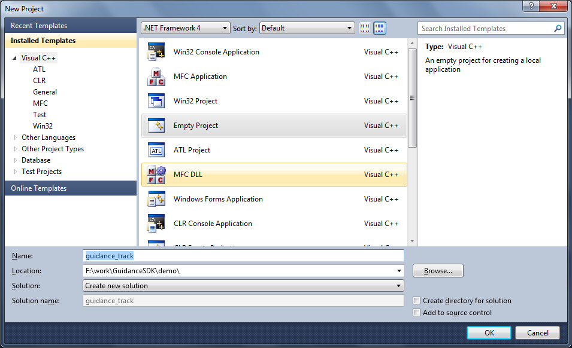

### 2. 添加相应的.h及.cpp到工程

#### 2.1 添加main.cpp

向工程中添加空的源文件main.cpp。

#### 2.2 添加DJI\_utility与DJI\_utility.cpp

首先将要使用到的线程操作保护的源文件DJI\_utility.cpp与头文件DJI\_utility.h复制到与main.cpp同目录下，并在项目中添加。DJI\_utility.cpp与DJI\_utility.h在demo及examples中均可找到。
 
- 在demo/sdk\_tracking\_camshift/camshift中的DJI\_utility相关文件。
- 将DJI\_utility文件复制到工程所在文件夹，并添加到guidanceSDK\_test工程中:

	 

	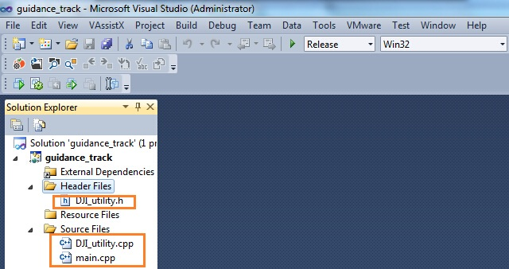

#### 2.3 配置头文件与链接库路径

需要配置的有**DJI\_guidance.h**、**DJI\_guidance.lib**与**OpenCV**头文件及库文件的路径。
DJI\_guidance.h头文件位于SDK/include中；DJI\_guidance.lib位于SDK/lib中，在VS2010中需要进行相应的配置将它们的路径包含到工程中。由于本教程运行于Release Win32模式下，最后编译输出x86平台的release文件，对应的**DJI\_guidance.lib**文件具体路径为**SDK/lib/2010/x86**。
 
- Visual Studio 2010工程为Release Win32模式：
	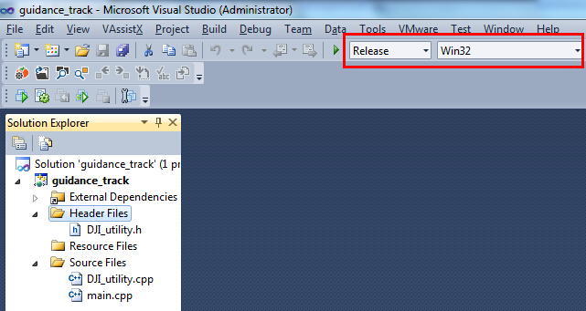 
- 在SDK/include中找到DJI\_guidance.h并复制到工程目录。
- 在SDK/lib/2010/x86中找到DJI\_guidance.lib并复制到工程目录。
- 将OpenCV相关的头文件和库文件目录添加到工程。

为简化配置的繁琐，可直接复制SDK/demo/sdk\_tracking\_camshift目录下的
**“use\_opencv\_release\_vs2010\_x86.props”**
**“use\_Guidance\_vs2010\_x86.props”** 
文件到解决方案目录下并添加到工程。
 
- 在sdk\_tracking\_camshift工程目录中找到 **“use\_opencv\_release\_vs2010\_x86.props”** 和
**“use\_Guidance\_vs2010\_x86.props”**配置文件：
	
	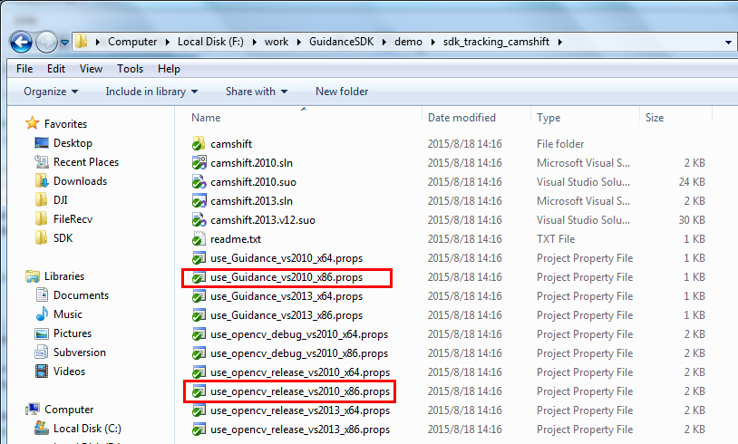 
- 将相应的props配置文件拷贝到 解决方案目录下：
	
	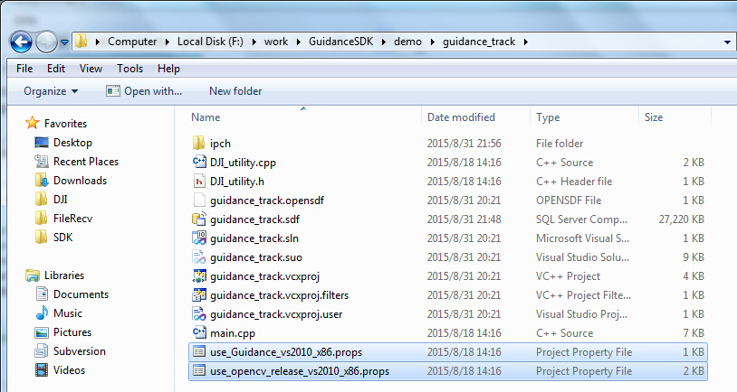 
- 切换工具栏到 **”配置管理器”**，右键单击Release | Win32，点击添加已有配置表 “Add Existing Property Sheet”，将工程目录下的 **“use\_opencv\_release\_vs2010\_x86.prop”** 与 **“use\_Guidance\_vs2010\_x86.prop”** 这两个配置文件添加到工程中：

	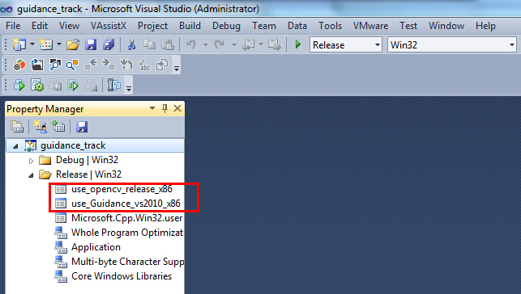 

>*请注意：这里默认用户已按照环境配置中所述的方法，安装了Opencv2411，并正确添加了环境变量OPENCVROOT。这一环境变量在OpenCV的配置文件中被用到。*

当工程路径变化时，用户也可以通过修改配置文件来适应；具体的可以查看相应的配置文件；这里给出一个Guidance相关文件配置的例子，OpenCV的配置类似。
 
- “use\_Guidance\_vs2010\_x86.prop”中配置的头文件路径:

	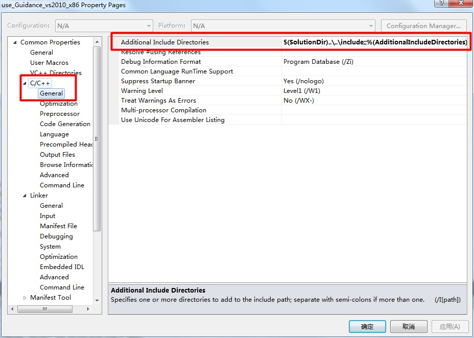 

- “use\_Guidance\_vs2010\_x86.prop”中配置的链接库路径:
 
	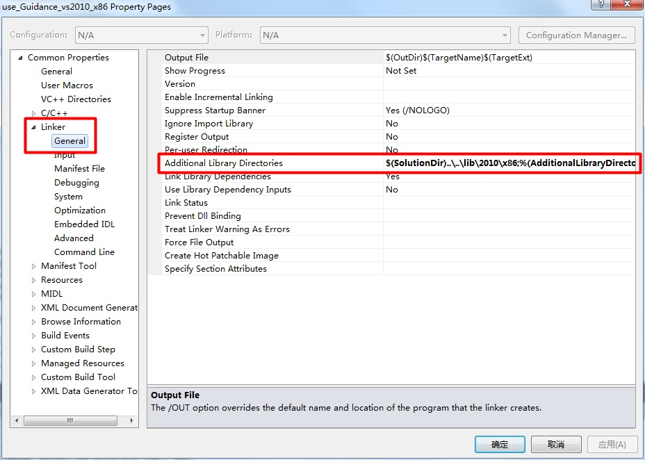 

### 3. 配置动态链接库文件

在SDK根目录下有lib文件夹，由于本教程中默认是VS2010建立的工程，并且运行Release Win32的程序，因此进入**lib/2010/x86**，将相应的**DJI\_guidance.dll**文件复制出来。
 
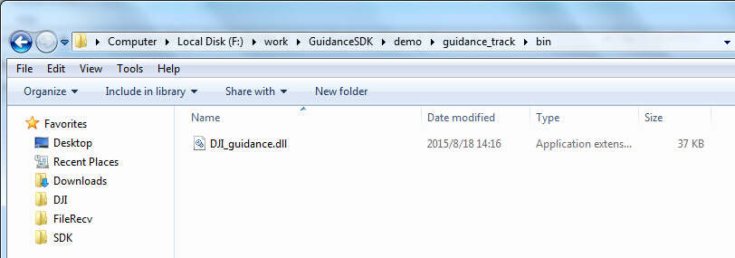 

### 4. 填入main.cpp代码

- 首先添加程序所需头文件。**DJI\_guidance.h**中包含了Guidance API函数声明的头文件，必须添加；**DJI\_utility.h**中包含了线程操作保护的头文件；**OpenCV**对应的头文件用于图像显示及视觉算法应用；

~~~cpp
#include "opencv2/video/tracking.hpp"
#include "opencv2/imgproc/imgproc.hpp"
#include "opencv2/highgui/highgui.hpp"
#include "opencv2/calib3d/calib3d.hpp"	
#include <fstream>
#include <iostream>
#include "DJI_guidance.h"
#include "DJI_utility.h"	

using namespace cv;
using namespace std;
~~~

- 	声明程序中需要用到的全局变量；其中image用作处理结果显示；g\_lock是与线程操作保护有关的对象，g\_event是与数据读取事件触发有关的对象，二者在DJI\_utility.h中均有定义；selection用作鼠标选择跟踪目标；WIDTH, HEIGHT及IMAGE\_SIZE宏定义为图像大小；

~~~cpp
Mat image;

bool selectObject = false;
int trackObject = 0;
Point origin;
Rect selection;
DJI_event g_event;
DJI_lock g_lock;

#define WIDTH 320
#define HEIGHT 240
#define IMAGE_SIZE (HEIGHT * WIDTH)
~~~

-	接着定义鼠标交互事件函数，该函数使得用户可以在图像传输开始时用鼠标框出要跟踪的目标；

~~~cpp
static void onMouse( int event, int x, int y, int, void* )
{
		if( selectObject )
		{
		    selection.x = MIN(x, origin.x);
		    selection.y = MIN(y, origin.y);
		    selection.width = std::abs(x - origin.x);
		    selection.height = std::abs(y - origin.y);
		
		    selection &= Rect(0, 0, image.cols, image.rows);
		}
		
		switch( event )
		{
		case CV_EVENT_LBUTTONDOWN:
		   	origin = Point(x,y);
		   	selection = Rect(x,y,0,0);
		   	selectObject = true;
		   	break;
		case CV_EVENT_LBUTTONUP:
		   	selectObject = false;
		   	if( selection.width > 0 && selection.height > 0 )
		      	trackObject = -1;
		   	break;
		}
}
~~~

-	再定义一个帮助函数，用来在Windows控制台模式下运行程序，如果输入 

~~~cpp
`guidanceSDK_test.exe -h` 
~~~

则会返回给用户程序使用方法； 

~~~cpp
static void help()
{
    	cout << "\nThis is a demo that shows camshift based tracking with Guidance.\n"
              "You select an objects such as your face and it tracks it.\n"
              "This reads from greyscale and depth images from DJI Guidance.\n"
              "Usage: \n"
              "   ./camshift.exe\n";

    	cout << "\n\nHot keys: \n"
              "\tESC/q - quit the program\n"
              "\tc - stop the tracking\n"
              "\tb - switch to/from backprojection view\n"
              "\tp - pause video\n"
              "To initialize tracking, select the object with mouse\n";
}
~~~

本教程给出的是基于camshift算法与深度图的视觉跟踪demo，当程序开始运行用户需要首先使用鼠标在**“Guidance Tracking Demo”窗口**中框出需要跟踪的目标，接着移动目标可以观察到跟踪效果；

 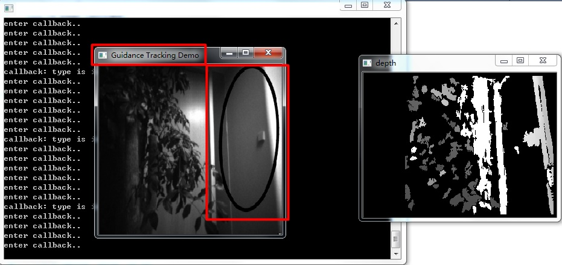 

- 然后定义一个回调函数，当订阅的数据到来时程序会自动调用该函数。**用户应该只在回调函数中进行轻量级的处理，比如数据拷贝等，否则会降低数据传输频率。**

~~~cpp
Mat g_imleft(HEIGHT, WIDTH, CV_8U);
Mat g_imright(HEIGHT, WIDTH, CV_8U);
Mat g_depth(HEIGHT, WIDTH, CV_16SC1);
e_vbus_index selected_vbus = e_vbus1;  // select front vbus
string winDemoName = "Guidance Tracking Demo";

int my_callback( int data_type, int data_len, char *content )
{
    		printf("enter callback..\n");
    		g_lock.enter();
    		if ( e_image == data_type && NULL != content )
    		{
        		printf("callback: type is image..\n");
        		image_data data;
        		memcpy((char*)&data, content, sizeof(data));
        		memcpy(g_imleft.data, data.m_greyscale_image_left[selected_vbus], IMAGE_SIZE);
        		memcpy(g_imright.data, data.m_greyscale_image_right[selected_vbus], IMAGE_SIZE);
        		memcpy(g_depth.data, data.m_depth_image[selected_vbus], IMAGE_SIZE * 2);
    		}
    		g_lock.leave();
    		g_event.set_event();
    		return 0;
}
~~~

- 当初始化、订阅或停止传输等操作失败时，返回为非0的int类型值，因此用户可以通过这些操作函数的返回值来判断失败的原因。我们这里宏定义两个操作，如果操作失败，则打印错误码或者直接终止程序；

~~~cpp
#define RETURN_IF_ERR(err_code) { if( err_code ){ printf( "USB error code:%d in file %s %d\n", err_code, __FILE__, __LINE__ );}}

#define RELEASE_IF_ERR(err_code) { if( err_code ){ release_transfer(); printf( "USB error code:%d in file %s %d\n", err_code, __FILE__, __LINE__ );}}
~~~

- 	在main函数中完成初始化、数据订阅、启动数据传输、图像处理显示、停止数据传输、释放传输线程等操作；

~~~cpp
int main( int argc, const char* argv[] )
{
    /* 帮助 */
    if(argc>1)
        help();

    /* 准备写入视频 */
    VideoWriter vWriter("result.avi", CV_FOURCC('M','J','P','G'), 25, Size(WIDTH, HEIGHT), false);
    /* 跟踪窗口 */
    Rect trackWindow;
    int hsize[] = {16, 16};
    float hranges[] = {0, 255};
    float dranges[] = {0, 255};
    
    const float* phranges[] = { hranges, dranges };

    selection = Rect(10,10,100,100);
    trackObject = 0;

    namedWindow( winDemoName, 0 );
    /* 等待鼠标框出 */
    setMouseCallback( winDemoName, onMouse, 0 );

    Mat imcolor, mask, hist, hist_of_object, backproj;
    bool paused = false;
    float hist_update_ratio = 0.2f;

    /* 初始化Guidance数据传输 */
    reset_config();
    int err_code = init_transfer();
    RETURN_IF_ERR(err_code);
    /* 订阅selected_vbus左侧灰度图 */    
    err_code = select_greyscale_image(selected_vbus, true);
    RELEASE_IF_ERR(err_code);
    /* 订阅selected_vbus右侧灰度图 */    
    err_code = select_greyscale_image(selected_vbus, false);
    RELEASE_IF_ERR(err_code);
    /* 订阅selected_vbus深度图 */
    err_code = select_depth_image(selected_vbus);
    RELEASE_IF_ERR(err_code);
    /* 设置数据到来时的回调函数*/
    err_code = set_sdk_event_handler(my_callback);
    RELEASE_IF_ERR(err_code);
    /* 开启数据传输线程 */
    err_code = start_transfer();
    RELEASE_IF_ERR(err_code);

    Mat depth(HEIGHT, WIDTH, CV_8UC1);
    /* 设置传输事件循环次数 */
    for( int times = 0; times < 30000; ++times )
    {
        /* 等待数据到来 */
        g_event.wait_event();

        // filter depth image
        filterSpeckles(g_depth, -16, 50, 20);
        // convert 16 bit depth image to 8 bit
        g_depth.convertTo(depth, CV_8UC1);
        /* 显示深度图 */
        imshow("depth", depth);
        waitKey(1);
        /* 获得灰度图 */
        g_imleft.copyTo(image);

        if( !paused )
        {
            vector<Mat> ims(3);
            ims[0] = image;
            ims[1] = ims[2] = depth;
            merge(ims, imcolor);
            /* 如果鼠标框出了目标，则进行跟踪及效果显示 */
            if( trackObject )
            {
                int ch[] = {0,1};
                if( trackObject < 0 )
                {
                    Mat roi(imcolor, selection);
                    
                    calcHist(&roi, 1, &ch[0], Mat(), hist, 2, &hsize[0], &phranges[0]);
                    normalize(hist, hist, 0, 255, CV_MINMAX);

                    if(hist_of_object.empty())
                        hist_of_object = hist;
                    else
                        hist_of_object = (1-hist_update_ratio)*hist_of_object + hist_update_ratio*hist;

                    trackWindow = selection;
                    trackObject = 1;
                }

                calcBackProject(&imcolor, 1, ch, hist_of_object, backproj, phranges);
                RotatedRect trackBox = CamShift(backproj, trackWindow,
                                    TermCriteria( CV_TERMCRIT_EPS | CV_TERMCRIT_ITER, 10, 1 ));
                
                if (trackWindow.area() <= 1)
                {
                    int cols = backproj.cols, rows = backproj.rows, r = (MIN(cols, rows) + 5)/6;
                    trackWindow = Rect(trackWindow.x - r, trackWindow.y - r,
                                       trackWindow.x + r, trackWindow.y + r) &
                                  Rect(0, 0, cols, rows);
                }
                if( trackWindow.area() <= 1 )
                    break;

                ellipse( image, trackBox, Scalar(0,0,255), 3, CV_AA );
            }
            else if( trackObject < 0 )
            {
                paused = false;
            }
        }

        if( selectObject && selection.width > 0 && selection.height > 0 )
        {
            Mat roi(image, selection);
            bitwise_not(roi, roi);
        }

        imshow( winDemoName, image );
        vWriter<<image;

        char c = (char)waitKey(10);
        /* 按q键退出 */
        if( c == 27 || c=='q')
        {
            break;
        }
        switch(c)
        {
        case 'c':
            trackObject = 0;            
            break;
        case 'p':
        case ' ':
            paused = !paused;
            break;
        default:
            ;
        }
    }
    /* 停止数据传输 */
    err_code = stop_transfer();
    RELEASE_IF_ERR(err_code);
    /* 确保停止 */
    sleep(100000);
    /* 释放传输线程 */
    err_code = release_transfer();
    RETURN_IF_ERR(err_code);

    return 0;
}
~~~

### 5. 编译运行

由于本教程默认guidance SDK运行所需的工作环境已经按照环境配置中配置成功，因此这里只需Build编译完工程，启动并通过USB线连接Guidance，点击Start Debugging即可运行程序。

## Linux

### 1. 新建工程文件夹

- 将SDK包下载到`~/Desktop/GuidanceSDK`目录。
- 新建工程目录 `~/Desktop/SDK/demo/guidance_track`，并添加DJI\_utility.cpp 与 DJI\_utility.h；另外main.cpp中的代码也与上一节Windows的介绍中相同，在此不赘述，直接拷贝过来。
	
		mkdir ~/Desktop/GuidanceSDK/demo/guidance_track
		cd ~/Desktop/SDK/demo/guidance_track

   

### 2. 添加libDJI\_guidance.so文件

由于本教程使用的是**32位的Ubuntu14.04系统**，因此去SDK根目录下的**so/x86**中，将**libDJI\_guidance.so**文件复制到**usr\local\lib** 文件夹下即可，不同位数系统请复制对应的.so文件。请注意，复制时需要用到`sudo`权限。

	sudo cp ~/Desktop/GuidanceSDK/so/x86/libDJI_guidance.so /usr/local/lib

### 3. 编写Makefile文件

接着编写Makefile文件。确保OpenCV已经正确安装。

	gedit Makefile

Makefile代码如下：

~~~
#定义编译器
CXX     = g++
#定义生成文件
TARGET  = main
#定义生成依赖文件 
OBJECTS = main.o DJI_utility.o
#定义头文件包含目录
CFLAGS  = -g -Wall -I/usr/local/include -I../../../include
#定义动态链接库路径、opencv路径及选项
LDFLAGS = -Wl,-rpath,./ -lpthread -lrt -L./ -L/usr/local/lib/ -lDJI_guidance -lusb-1.0 `pkg-config --cflags --libs opencv` 

$(TARGET) : $(OBJECTS)
    $(CXX) -o $(TARGET) $(OBJECTS) $(LDFLAGS)
main.o : main.cpp DJI_utility.h
    $(CXX) $(CFLAGS) -c main.cpp DJI_utility.h
DJI_utility.o : DJI_utility.cpp DJI_utility.h
    $(CXX) $(CFLAGS) -c DJI_utility.cpp DJI_utility.h
clean:
    rm -rf *.o *.gch *.avi $(TARGET)
~~~

### 4. 编译与运行

- 启动Guidance，并通过USB线将其与电脑连接。
- 编译并运行工程

		make
		sudo ./main
- 当程序启动后，在“Guidance Tracking Demo”窗口中用鼠标框出待跟踪目标，接着可以在图上看到目标跟踪效果：

	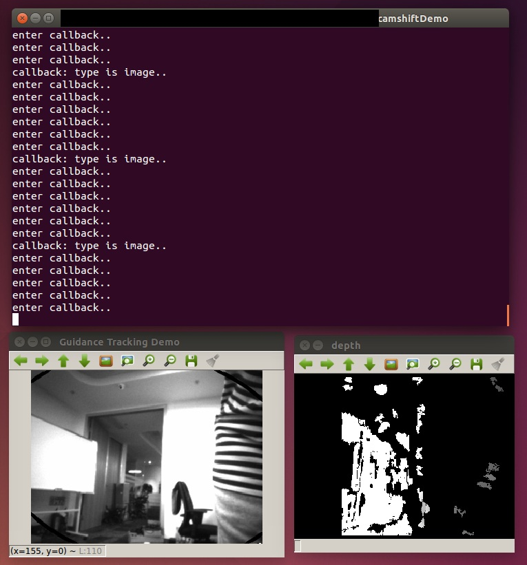 

- 在该窗口上按 `q` 键退出程序。

