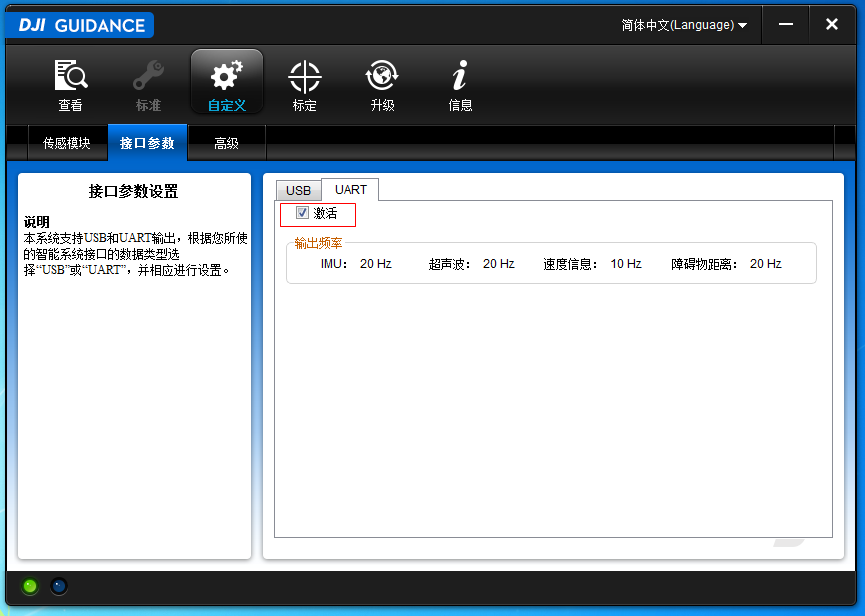
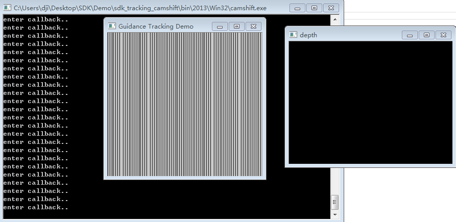
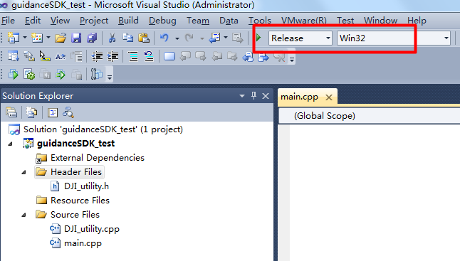
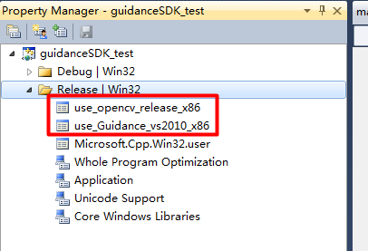

# 开发者指南
## 环境配置
### Windows
#### 安装DJI_Guidance软件
首先，在Windows平台下安装DJI_Guidance软件。软件在安装过程中会自动安装Guidance所需的USB驱动，在软件安装引导结束后需重启系统使之生效。系统重新启动后，将Guidance通过USB连至电脑并上电，进入**“计算机管理-设备管理器”**中查看，如果在设备列表中出现“DJI, Inc. - Guidance”，意味着软件安装成功。

---

#### 安装UART驱动
如果要通过UART使用Guidance SDK，需要安装USB转RS232的驱动。使用过程中请注意，Guidance SDK中examples默认读取的串口号为**“COM5”**。如果您的计算机上的串口号与之不同，请修改代码中的设置或更改设备串口号。

---

#### 通过DJI_Guidance软件激活并订阅数据
>*假设用户已经在Windows上正确安装了DJI_Guidance软件*
 
- 首先，将Guidance连接至电脑并上电启动；接着等待Guidance上的绿灯开始闪烁后，打开DJI_Guidance软件，可以看到软件**“查看”**页面的左下角绿灯亮起，说明连接正常；此时将工作模式设置为**“自定义模式”**。

- 然后转到“自定义”页面，在“接口参数”选项卡中根据需要激活USB与UART，并通过勾选相应的选项来订阅图像数据及图像输出频率；图像数据及频率设置也可通过Guidance SDK中相应的API进行设置。

- 关闭DJI_Guidance软件并重启Guidance使配置生效。

---

#### 推荐使用Visual Studio
Guidance SDK中提供了Demo与examples供参考使用,其中包含了Visual Studio 2010的完整配置文件与Visual studio 2013的部分配置文件。分别是Windows7系统下测试通过的32位与64位、debug与release相关的opencv与SDK配置文件，形如**“use\_Guidance\_\*.prop”**, **“use\_opencv\_\*.prop”**，用户可以根据需要将它们复制并添加到自己的工程中，省去配置的麻烦。

---
#### 安装OpenCV
Guidance SDK分别在Opencv2.4.8、OpenCV2.4.9及OpenCV2.4.11上进行了测试，Demo及examples中的例程默认使用的是OpenCV2.4.11版本。用户可以从OpenCV官方网站[http://opencv.org/](http://opencv.org/)上下载合适版本的OpenCV并安装到电脑上。使用时请注意，在Demo及examples的配置文件中，由于使用了 **OPENCVROOT** 的环境变量，因此用户在配置OpenCV环境的过程中需要新建一个名为 **OPENCVROOT** 的系统环境变量，其值为OpenCV的安装目录。
>*假设用户已经成功在电脑上安装了OpenCV2.4.11*

- 安装目录为**D:/OPENCV/opencv2411/build[sources]**，如下图所示，进入**“高级系统设置-环境变量-系统变量”**，新建一个变量，变量名为**OPENCVROOT**，值为 D:\OPENCV\opencv2411\

- 接着在系统变量的PATH变量尾部添加OpenCV的库目录，注意不同目录间用分号隔开: 
**D:/OPENCV/opencv2411/build/x64/vc10/bin;**
**D:/OPENCV/opencv2411/build/x86/vc10/bin;**   
- 如果用户使用Visual Studio作为开发环境，接下来就只需将相应的 **“use\_Guidance\_\*.prop”** 与 **“use\_opencv\_\*.prop”** 配置文件添加到工程中去即可；或者也可直接复制例程，在例程的基础上进行开发。

---

#### 正确放置DJI_Guidance.dll
>*务必记得将DJI_Guidance.dll拷贝至exe所在的目录，否则会显示无法找到DJI_Guidance.dll的错误*

### Linux
#### 安装libusb驱动
从[http://www.libusb.org/](http://www.libusb.org/)下载并解压**“libusb-1.0.9.tar.bz2”**，并按照指导正确安装libusb驱动；不推荐通过`apt-get install` 安装libusb驱动；
例如:
解压**libusb-1.0.9.tar.bz2**并利用`cd`命令跳转到解压目录下；接着运行以下指令:

	>> ./configure
	>> make
	>> make install

---

#### 安装UART驱动
Linux默认包含了UART驱动，不需要另外安装。

---

#### 通过DJI_Guidance软件激活并订阅数据
参考上一篇**通过DJI_Guidance软件激活并订阅数据**。

---

#### 将g++更新到最新版本
请确保使用的是最新版本的g++；如果更新后仍提示无法找到g++指令，请检查系统时间是否与真实世界不同步！ 
例如:

	>> sudo apt-get install g++

	
---

####安装OpenCV
用户可以直接通过apt-get install来安装OpenCV: 

	>> sudo apt-get install libopencv-dev

或者，用户可以上GitHub下载**Install-OpenCV-master**压缩包并解压到本地，这是由jayrambhia提供的一个Linux下各OpenCV版本的安装脚本，利用这个脚本用户可以非常方便地将OpenCV安装到Linux； 
例如:

	>> cd PATH/TO/Install-OpenCV-master/Ubuntu
	>> ./dependencies.sh 
	>> cd 2.4
	>> ./opencv2_4_9.sh

---

####正确放置DJI_Guidance.so
将相应的Guidance共享库**libDJI_Guidance.so**拷贝至**/usr/local/lib**.
例如: 

	>> sudo cp libDJI_Guidance.so /usr/local/lib

---

#### 通过sudo指令运行程序
- 使用Guidance的USB接口时，需要使用`sudo`指令，以取得对USB接口的root权限。否则会出现*permission denied*的错误。
例如:

		>> sudo ./guidance_example
- 为了避免每次都要使用sudo来运行Guidance SDK程序的麻烦，可以在`/etc/udev/rules.d/`文件夹中创建一个规则文件`51-guidance.rules`，内容如下：
 
		SUBSYSTEM=="usb", ATTR{idVendor}=="18d1", ATTR{idProduct}=="d008", MODE="0666"
		SUBSYSTEM=="usb", ATTR{idVendor}=="18d1", ATTR{idProduct}=="d009", MODE="0666"
然后再拨插USB线，就可以以普通用户的权限来运行Guidance SDK程序了。
 
---

### 常见错误
> *参考开发者指南给出的方法进行开发环境的搭建，能够避免大部分的错误。*

---

#### 连接错误
***问题描述:***

“usb error” 或者类似的报错，例如:
 

***解决方法:***

- 首先确定Guidance已经连接到电脑上，并且Guidance上的绿灯开始进入闪烁状态；
- 检查USB驱动是否正确安装，Windows下的检查方法连接上Guidance后进入设备管理器中查看；或者使用DJIGuidance软件进行查看，如果**“查看”**页面左下角的绿灯亮起，说明USB驱动已经正确安装；否则请参考开发者指南安装DJI_Guidance软件；Linux下用户需严格遵循开发者指南中给出的安装方法进行安装，通过Guidance SDK中相关的USB例程进行测试；
- 如果在Windows下使用UART获取数据，请检查串口号是否为**“COM5**”；否则请在查看串口端号后，在examples中进行相应更改；
- 成功连接上DJI_Guidance软件后，进入**“自定义”**界面的**“接口参数”**选项卡，查看是否已经激活USB或UART选项；如果没有激活，请勾选相应的选项并关闭软件与Guidance，Guidance重启后配置生效；
- 如果数据传输非正常退出，也就是线程在运行到**stop_transfer()**与**release_transfer()**之前就退出，也会导致此类错误，这种情况下需要重启Guidance； 
- 在Linux下请务必使用`sudo`命令启动程序；
- 请确认在Guidance上的绿灯开始闪烁后运行程序；
- 请确认在使用SDK时已关闭“DJI_Guidance”软件；
- 在虚拟机上运行可能会导致问题；

---

#### 编译错误
##### 共享库加载错误
***错误描述:***

	Error while loading shared libraries : libDJI_guidance.so: cannot open shared object file : No such file or directory.

	
***解决方法:***

- 请确认将系统所对应的**DJI_Guidance.so**复制到了**/usr/local/lib**目录下；若仍存在这种错误，请将其再拷贝一份至out程序运行目录下；
- 请确认该so文件与你电脑的系统版本是对应的；

---

##### 无法打开DJI_Guidance.dll文件
***错误描述:***

	Cannot open DJI_Guidance.dll file:No such file or directory.

    
***解决方法:***

请确认将系统所对应的**DJI_Guidance.dll**分别复制到了lib文件夹与*.exe程序运行目录下；

---

##### OpenCV相关错误
***错误描述:***

无法打开与OpenCV有关的**\*.h**与**\*.dll**等文件；

***解决办法:***

请确认OpenCV是否正确安装，且版本与程序要求的一致；另外，若运行Guidance SDK中给出的Demo与examples，记得要在系统变量中添加**OPENCVROOT**变量；

---

#### 数据传输错误
***错误描述:***

数据传输错误一般指得到了不正确的数据，例如图像显示错误:

***解决办法:***

- 首先检查你的代码，或者通过Guidance SDK中给出的例程进行检验；
- 确认不是代码的问题后，请重启Guidance，并在Guidance上的绿灯开始闪烁后再运行程序；这种情况一般是由于非正常退出导致的，例如线程在运行到**stop\_transfer()**与 **release\_transfer()**之前就已经退出。

---
 
## 如何创建一个基于Guidance SDK的视觉跟踪程序
>*注意: 请确保在非虚拟机上运行本教程代码*

这里我们要实现的功能是利用Guidance SDK中的API，通过USB从Guidance中读取图像数据，使用camshift完成一个视觉跟踪的应用。
### 下载并解压SDK
你可以从GitHub下载到最新的SDK: https://github.com/dji-sdk

内容包括：

- **demo**：一个基于Guidance SDK 的视觉跟踪应用
- **doc**: API说明文档
- **examples**: USB, UART及ROS的示例代码
- **include**: Guidance SDK头文件
- **lib**: Windows下库文件
- **so**: Linux下库文件

解压SDK到相应目录。

### Windows
#### 1 新建guidanceSDK_test测试工程
如下图所示，在SDK/demo目录下创建自己的工程，这里在VS2010中创建了一个**“Win32控制台程序”**类型的空工程，工程名为**“guidanceSDK\_test”**。

 

#### 2 添加相应的.h及.cpp到工程
##### 2.1 添加main.cpp
向工程中添加空的源文件main.cpp。
##### 2.2 添加DJI\_utility与DJI\_utility.cpp
首先将要使用到的线程操作保护的源文件DJI\_utility.cpp与头文件DJI\_utility.h复制到与main.cpp同目录下，并在项目中添加。（DJI\_utility.cpp与DJI\_utility.h在demo及examples中均可找到）
 

图5 在demo/sdk\_tracking\_camshift/camshift中的DJI\_utility文件

图6 将DJI\_utility文件复制到guidanceSDK\_test工程中
 

图7 在guidanceSDK\_test工程中添加DJI\_utility文件

##### 2.3 配置头文件与链接库路径
需要配置的有**DJI\_guidance.h**、**DJI\_guidance.lib**与**OpenCV**头文件及库文件的路径。
DJI\_guidance.h头文件位于SDK/include中；DJI\_guidance.lib位于SDK/lib中，在VS2010中需要进行相应的配置将它们的路径包含到工程中。由于本教程运行于Release Win32模式下，最后编译输出x86平台的release文件，对应的**DJI\_guidance.lib**文件具体路径为**SDK/lib/2010/x86**。
 

 

图10 本教程使用的DJI_guidance.lib位于SDK/lib/2010/x86

简化配置的繁琐，直接复制SDK/demo/sdk\_tracking\_camshift目录下的
**“use\_opencv\_release\_vs2010\_x86.prop”**
**“use\_Guidance\_vs2010\_x86.prop”** 
文件，拷贝到 ”guidanceSDK\_test.sln” 目录下；
 

图11 复制sdk\_tracking\_camshift工程的prop配置文件
 

图12 将相应的prop配置文件拷贝到 guidanceSDK\_test 工程目录下

如下图所示，切换工具栏到 **”配置管理器”**，右键单击Release | Win32，点击添加已有配置表 “Add Existing Property Sheet”，将工程目录下的 **“use\_opencv\_release\_vs2010\_x86.prop”** 与 **“use\_Guidance\_vs2010\_x86.prop”** 这两个配置文件添加到工程中。
 

图13 添加prop配置文件到工程
 

图14 配置完成

>*请注意：这里默认用户已按照环境配置中所述的方法，安装了Opencv2411，并添加了环境变量OPENCVROOT及OpenCV对应的PATH路径。*

当工程路径变化时，用户也可以通过修改配置文件来适应；具体的可以查看相应的配置文件；这里给出一个Guidance相关文件配置的例子，OpenCV同理。
 

图15 “use\_Guidance\_vs2010\_x86.prop”中配置的头文件路径
 

图16 “use\_Guidance\_vs2010\_x86.prop”中配置的链接库路径

#### 3 配置动态链接库文件
在SDK根目录下有lib文件夹，由于本教程中默认是VS2010建立的工程，并且运行Release Win32的程序，因此进入**lib/2010/x86**，将相应的**DJI\_guidance.dll**文件复制出来。
 

图17 程序运行在Release | Win32模式下
 

图18 工程所需的dll文件与lib文件目录

将DJI\_guidance.dll复制到bin文件目录下，这里bin文件目录在同*.sln目录下；
 

图19 复制对应的dll文件到 guidanceSDK\_test的bin目录下

至此，动态链接库配置完成。

#### 4 填入main.cpp代码
- 首先添加程序所需头文件，DJI\_guidance.h中包含了Guidance API函数声明的头文件，必须添加；DJI\_utility.h中包含了线程操作保护的头文件；opencv对应的头文件用于图像显示及视觉算法应用；

		#include "opencv2/video/tracking.hpp"
		#include "opencv2/imgproc/imgproc.hpp"
		#include "opencv2/highgui/highgui.hpp"
		#include "opencv2/calib3d/calib3d.hpp"	
		#include <fstream>
		#include <iostream>
		#include "DJI_guidance.h"
		#include "DJI_utility.h"	
		
		using namespace cv;
		using namespace std;

- 	声明程序中需要用到的全局变量；其中image用作处理结果显示；g\_lock是与线程操作保护有关的对象，g\_event是与数据读取事件触发有关的对象，二者在DJI\_utility.h中均有定义；selection用作鼠标选择跟踪目标；WIDTH, HEIGHT及IMAGE\_SIZE宏定义为图像大小；

		Mat image;
		
		bool selectObject = false;
		int trackObject = 0;
		Point origin;
		Rect selection;
		DJI_event g_event;
		DJI_lock g_lock;
		
		#define WIDTH 320
		#define HEIGHT 240
		#define IMAGE_SIZE (HEIGHT * WIDTH)

-	接着定义鼠标交互事件函数，该函数使得用户可以在图像传输开始时用鼠标框出要跟踪的目标；

		static void onMouse( int event, int x, int y, int, void* )
		{
				if( selectObject )
				{
				    selection.x = MIN(x, origin.x);
				    selection.y = MIN(y, origin.y);
				    selection.width = std::abs(x - origin.x);
				    selection.height = std::abs(y - origin.y);
				
				    selection &= Rect(0, 0, image.cols, image.rows);
				}
				
				switch( event )
				{
				case CV_EVENT_LBUTTONDOWN:
				   	origin = Point(x,y);
				   	selection = Rect(x,y,0,0);
				   	selectObject = true;
				   	break;
				case CV_EVENT_LBUTTONUP:
				   	selectObject = false;
				   	if( selection.width > 0 && selection.height > 0 )
				      	trackObject = -1;
				   	break;
				}
		}

-	再定义一个帮助函数，用来在Windows控制台模式下运行程序，如果输入 
`guidanceSDK_test.exe -h` 
则会返回给用户程序使用方法； 

		static void help()
		{
		    	cout << "\nThis is a demo that shows camshift based tracking with Guidance.\n"
		              "You select an objects such as your face and it tracks it.\n"
		              "This reads from greyscale and depth images from DJI Guidance.\n"
		              "Usage: \n"
		              "   ./camshift.exe\n";
		
		    	cout << "\n\nHot keys: \n"
		              "\tESC/q - quit the program\n"
		              "\tc - stop the tracking\n"
		              "\tb - switch to/from backprojection view\n"
		              "\tp - pause video\n"
		              "To initialize tracking, select the object with mouse\n";
		}

本教程给出的是基于camshift算法与深度图的视觉跟踪demo，当程序开始运行用户需要首先使用鼠标在**“Guidance Tracking Demo”窗口**中框出需要跟踪的目标，接着移动目标可以观察到跟踪效果；
 

图20 用户需用鼠标在灰度图窗口上框出被跟踪目标
 

图21 bin目录下生成result.avi记录视频

- 然后定义一个回调函数，当订阅的数据到来时程序会自动调用该函数。**用户应该只在回调函数中进行轻量级的处理，比如复制和显示等，否则会降低数据传输频率。**

		Mat g_imleft(HEIGHT, WIDTH, CV_8U);
		Mat g_imright(HEIGHT, WIDTH, CV_8U);
		Mat g_depth(HEIGHT, WIDTH, CV_16SC1);
		e_vbus_index selected_vbus = e_vbus1;  // select front vbus
		string winDemoName = "Guidance Tracking Demo";
		
		int my_callback( int data_type, int data_len, char *content )
		{
		    		printf("enter callback..\n");
		    		g_lock.enter();
		    		if ( e_image == data_type && NULL != content )
		    		{
		        		printf("callback: type is image..\n");
		        		image_data data;
		        		memcpy((char*)&data, content, sizeof(data));
		        		memcpy(g_imleft.data, data.m_greyscale_image_left[selected_vbus], IMAGE_SIZE);
		        		memcpy(g_imright.data, data.m_greyscale_image_right[selected_vbus], IMAGE_SIZE);
		        		memcpy(g_depth.data, data.m_depth_image[selected_vbus], IMAGE_SIZE * 2);
		    		}
		    		g_lock.leave();
		    		g_event.set_event();
		    		return 0;
		}

- 当初始化、订阅或停止传输等操作失败时，返回为非0的int类型值，因此用户可以通过这些操作函数的返回值来判断失败的原因。我们这里宏定义两个操作，如果操作失败，则打印错误码或者直接终止程序；

	`#define RETURN_IF_ERR(err_code) { if( err_code ){ printf( "USB error code:%d in file %s %d\n", err_code, __FILE__, __LINE__ );}}`
	`#define RELEASE_IF_ERR(err_code) { if( err_code ){ release_transfer(); printf( "USB error code:%d in file %s %d\n", err_code, __FILE__, __LINE__ );}}`

- 	在main函数中完成初始化、数据订阅、启动数据传输、图像处理显示、停止数据传输、释放传输线程等操作；

		int main( int argc, const char* argv[] )
		{
		    /* 帮助 */
		    if(argc>1)
		        help();
		
		    /* 准备写入视频 */
		    VideoWriter vWriter("result.avi", CV_FOURCC('M','J','P','G'), 25, Size(WIDTH, HEIGHT), false);
		    /* 跟踪窗口 */
		    Rect trackWindow;
		    int hsize[] = {16, 16};
		    float hranges[] = {0, 255};
		    float dranges[] = {0, 255};
		    
		    const float* phranges[] = { hranges, dranges };
		
		    selection = Rect(10,10,100,100);
		    trackObject = 0;
		
		    namedWindow( winDemoName, 0 );
		    /* 等待鼠标框出 */
		    setMouseCallback( winDemoName, onMouse, 0 );
		
		    Mat imcolor, mask, hist, hist_of_object, backproj;
		    bool paused = false;
		    float hist_update_ratio = 0.2f;
		
		    /* 初始化Guidance数据传输 */
		    reset_config();
		    int err_code = init_transfer();
		    RETURN_IF_ERR(err_code);
		    /* 订阅selected_vbus左侧灰度图 */    
		    err_code = select_greyscale_image(selected_vbus, true);
		    RELEASE_IF_ERR(err_code);
		    /* 订阅selected_vbus右侧灰度图 */    
		    err_code = select_greyscale_image(selected_vbus, false);
		    RELEASE_IF_ERR(err_code);
		    /* 订阅selected_vbus深度图 */
		    err_code = select_depth_image(selected_vbus);
		    RELEASE_IF_ERR(err_code);
		    /* 设置数据到来时的回调函数*/
		    err_code = set_sdk_event_handler(my_callback);
		    RELEASE_IF_ERR(err_code);
		    /* 开启数据传输线程 */
		    err_code = start_transfer();
		    RELEASE_IF_ERR(err_code);
		
		    Mat depth(HEIGHT, WIDTH, CV_8UC1);
		    /* 设置传输事件循环次数 */
		    for( int times = 0; times < 30000; ++times )
		    {
		        /* 等待数据到来 */
		        g_event.wait_event();
		
		        // filter depth image
		        filterSpeckles(g_depth, -16, 50, 20);
		        // convert 16 bit depth image to 8 bit
		        g_depth.convertTo(depth, CV_8UC1);
		        /* 显示深度图 */
		        imshow("depth", depth);
		        waitKey(1);
		        /* 获得灰度图 */
		        g_imleft.copyTo(image);
		
		        if( !paused )
		        {
		            vector<Mat> ims(3);
		            ims[0] = image;
		            ims[1] = ims[2] = depth;
		            merge(ims, imcolor);
		            /* 如果鼠标框出了目标，则进行跟踪及效果显示 */
		            if( trackObject )
		            {
		                int ch[] = {0,1};
		                if( trackObject < 0 )
		                {
		                    Mat roi(imcolor, selection);
		                    
		                    calcHist(&roi, 1, &ch[0], Mat(), hist, 2, &hsize[0], &phranges[0]);
		                    normalize(hist, hist, 0, 255, CV_MINMAX);
		
		                    if(hist_of_object.empty())
		                        hist_of_object = hist;
		                    else
		                        hist_of_object = (1-hist_update_ratio)*hist_of_object + hist_update_ratio*hist;
		
		                    trackWindow = selection;
		                    trackObject = 1;
		                }
		
		                calcBackProject(&imcolor, 1, ch, hist_of_object, backproj, phranges);
		                RotatedRect trackBox = CamShift(backproj, trackWindow,
		                                    TermCriteria( CV_TERMCRIT_EPS | CV_TERMCRIT_ITER, 10, 1 ));
		                
		                if (trackWindow.area() <= 1)
		                {
		                    int cols = backproj.cols, rows = backproj.rows, r = (MIN(cols, rows) + 5)/6;
		                    trackWindow = Rect(trackWindow.x - r, trackWindow.y - r,
		                                       trackWindow.x + r, trackWindow.y + r) &
		                                  Rect(0, 0, cols, rows);
		                }
		                if( trackWindow.area() <= 1 )
		                    break;
		
		                ellipse( image, trackBox, Scalar(0,0,255), 3, CV_AA );
		            }
		            else if( trackObject < 0 )
		            {
		                paused = false;
		            }
		        }
		
		        if( selectObject && selection.width > 0 && selection.height > 0 )
		        {
		            Mat roi(image, selection);
		            bitwise_not(roi, roi);
		        }
		
		        imshow( winDemoName, image );
		        vWriter<<image;
		
		        char c = (char)waitKey(10);
		        /* 按q键退出 */
		        if( c == 27 || c=='q')
		        {
		            break;
		        }
		        switch(c)
		        {
		        case 'c':
		            trackObject = 0;            
		            break;
		        case 'p':
		        case ' ':
		            paused = !paused;
		            break;
		        default:
		            ;
		        }
		    }
		    /* 停止数据传输 */
		    err_code = stop_transfer();
		    RELEASE_IF_ERR(err_code);
		    /* 确保停止 */
		    sleep(100000);
		    /* 释放传输线程 */
		    err_code = release_transfer();
		    RETURN_IF_ERR(err_code);
		
		    return 0;
		}

#### 5 编译运行
由于本教程默认guidance SDK运行所需的工作环境已经按照环境配置中配置成功，因此这里只需Build编译完工程，启动并通过USB线连接Guidance，点击Start Debugging即可运行程序。
### Linux
#### 1 新建工程文件夹
在SDK根目录下新建用户工程目录，这里建立了两层目录**“demo\guidanceSDK\_test\camshiftDemo”** ，并在 camshiftDemo 文件夹中添加了DJI\_utility.cpp 与 DJI\_utility.h，具体请见上一部分；另外main.cpp中的代码也与上一节Windows的介绍中相同，在此不赘述，直接拷贝过来。
 

图22 拷贝DJI\_utility文件及main.cpp

#### 2 添加libDJI\_guidance.so文件
由于本教程使用的是**32位的Ubuntu14.04系统**，因此去SDK根目录下的**so/x86**中，将**libDJI\_guidance.so**文件复制到**usr\local\lib** 文件夹下即可，不同位数系统请复制对应的.so文件。请注意，复制时需要用到`sudo`权限。
 

图23 guidance动态链接库目录
 

图24 拷贝libDJI\_guidance.so到usr\local\lib下

#### 3 编写Makefile文件
接着编写Makefile文件对工程进行编译，查看guidance SDK的头文件及动态链接库文件目录；

图25 guidance头文件目录
在camshiftDemo文件夹下新建Makefile文件并编写相应的Makefile代码。这里默认用户已经按照环境配置配置好OpenCV。
 

图26 添加Makefile文件

Makefile代码如下：

	#定义编译器
	CXX     = g++
	#定义生成文件
	TARGET  = main
	#定义生成依赖文件 
	OBJECTS = main.o DJI_utility.o
	#定义头文件包含目录
	CFLAGS  = -g -Wall -I/usr/local/include -I../../../include
	#定义动态链接库路径、opencv路径及选项
	LDFLAGS = -Wl,-rpath,./ -lpthread -lrt -L./ -L/usr/local/lib/ -lDJI_guidance -lusb-1.0 `pkg-config --cflags --libs opencv` 
	
	$(TARGET) : $(OBJECTS)
	    $(CXX) -o $(TARGET) $(OBJECTS) $(LDFLAGS)
	main.o : main.cpp DJI_utility.h
	    $(CXX) $(CFLAGS) -c main.cpp DJI_utility.h
	DJI_utility.o : DJI_utility.cpp DJI_utility.h
	    $(CXX) $(CFLAGS) -c DJI_utility.cpp DJI_utility.h
	clean:
	    rm -rf *.o *.gch *.avi $(TARGET)

#### 4 编译与运行
`cd`到 “**camshiftDemo”** 文件夹目录下，运行命令 `make` ，接着等待编译完成后，连接并启动Guidance，运行命令 `sudo ./main` ；运行正确应显示如下图所示状态。当程序启动后，在“Guidance Tracking Demo”窗口中用鼠标框出待跟踪目标，接着可以在图上看到目标跟踪效果，在该窗口上按 **’q’** 键退出程序。

